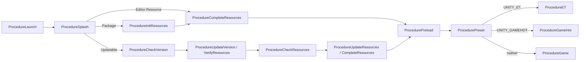

# 模块 01：总体架构与 Unity 启动流程

> Catalog ID: `ARCH-01`、`UNITY-01`  
> 状态：`verified`  
> 最后核验：`2026-08-05`  
> 适用模式：GameHot / ET Client / ET Server / Shared

## 模块定位

GameDevelopmentKit 是 Unity 客户端与 ET 服务端共仓框架。Unity 客户端以 UGF 负责基础生命周期和资源流程，再通过 `CodeRunnerComponent` 进入 GameHot 或 ET 业务；独立服务端位于 `DotNet/`；配置、协议和编译期工具位于 `Share/`、`Design/`、`Tools/`。

本模块负责回答“进程从哪里启动、基础组件何时可用、何时进入业务模式”。具体 UI、Entity、网络或构建行为由关联模块负责。

## 源码边界

| 类型 | 仓库相对路径 | 说明 |
| --- | --- | --- |
| Unity 场景入口 | `Unity/Assets/Launcher.unity` | 挂载 UGF 与项目组件的启动场景 |
| 项目 GameEntry | `Unity/Assets/Scripts/Game/Base/GameEntry.cs` | 初始化组件引用并启动 UGF |
| 基础组件映射 | `Unity/Assets/Scripts/Game/Base/GameEntry.Builtin.cs` | UGF 内置组件静态入口 |
| 扩展组件映射 | `Unity/Assets/Scripts/Game/Base/GameEntry.Extension.cs` | AssetSet、CodeRunner、NetworkService、Screen |
| 项目组件映射 | `Unity/Assets/Scripts/Game/Base/GameEntry.Game.cs` | Builtin、Camera、Platform、Tables |
| 启动流程 | `Unity/Assets/Scripts/Game/Procedure` | 资源准备与业务模式切换 |
| Unity 业务 | `Unity/Assets/Scripts/Game/Hot`、`Unity/Assets/Scripts/Game/ET` | GameHot 与 ET 客户端代码 |
| 根解决方案 | `Kit.sln` | 当前跟踪的 DotNet、Share 工具与 Buqi 无头验证项目 IDE 入口 |
| 服务端解决方案 | `DotNet/DotNet.sln` | 当前跟踪的 DotNet 服务端 IDE 入口 |
| 服务端 | `DotNet` | 独立 ET 服务端程序集 |
| 共享工具 | `Share`、`Design`、`Tools`、`Config` | 生成器、源数据、工具与服务端导出配置 |

`Unity/Unity.sln` 是 Unity/IDE 可在本地生成的工程文件；当前 checkout 下该文件不存在，也不是 catalog 声明的仓库源，不应把它当作已跟踪入口维护。根 `Kit.sln` 包含 DotNet、Share 工具、Aspire 与 Buqi headless 验证项目；`DotNet/DotNet.sln` 只包含服务端项目。

## 依赖关系

```text
Launcher Scene
  -> Game.GameEntry
     -> UnityGameFramework.Runtime.GameEntry
     -> UGF 内置组件
     -> UnityGameFramework.Extension 组件
     -> Game 项目组件
  -> UGF Procedure FSM
     -> CodeRunnerComponent
        -> Game.Hot.Init 或 ET.Init
```

Unity 业务依赖 `Game.asmdef` 暴露的项目基础层。服务端不依赖 Unity 程序集，而是通过 DotNet.Core/Loader/Model/Hotfix 复用 ET 结构和生成代码。

ARCH-01 的顶层非 Unity 证据链是：`Kit.sln` 聚合 DotNet、Share 工具项目，并纳入 `Buqi.Simulation.Headless` 对 GameHot/Buqi/Battle 纯 C# 源码的无头编译验证入口；`DotNet/App/Program.cs` 调用 `Entry.Init()`、创建 `DotNet/Loader/Init.cs` 并进入 Update/LateUpdate 循环；`DotNet/Loader/Init.cs` 解析命令行后注册 Logger、TimeInfo、FiberManager、ConfigComponent 和 CodeLoaderComponent；`DotNet/Loader/ConfigReader.cs` 把服务端配置定位到 `../Config/Luban/*.bytes|*.json`；`Share/Tool/Loader/Init.cs` 根据 `AppType` 分派 ExcelExporter、Proto2CS 和 LocalizationExporter；`Design/Excel/ET/luban.conf` 会把 ET clientserver 数据导到 Unity 资源和 `%ROOT%/Config/Luban`，`Design/Excel/GameHot/luban.conf` 会把 GameHot client 数据导到 Hot 资源；`Tools/Shell/start et server.bat` 从 `Bin` 执行 `dotnet App.dll --Process=1 --StartConfig=Localhost --Console=1`。更细的服务端、共享工具和 Luban 规则分别见模块 21、22、17。

## 入口与调用链

### GameEntry 初始化

`GameEntry.Start()` 的固定顺序是：

1. `InitBuiltinComponents()`：取得 Base、Resource、UI、Scene、Entity、Sound、Localization、Procedure 等 UGF 组件。
2. `InitExtensionComponents()`：取得 AssetSet、CodeRunner、NetworkService、Screen。
3. `InitGameComponents()`：取得 Builtin、Camera、Platform、Tables。
4. `UnityGameFramework.Runtime.GameEntry.Initialize()`：启动 UGF 框架。

退出应用时，只有 UGF 已初始化才调用 `Shutdown(Quit)`。

### Procedure 主链



`ProcedureLaunch` 订阅 UGF 异步事件、初始化语言和声音，并在下一帧进入 Splash。`ProcedurePreload` 完成基础预载后进入 `ProcedurePreset`。Preset 根据编译宏只选择一个业务分支。

## 核心类型与 API

| 类型/API | 职责 | 生命周期/约束 |
| --- | --- | --- |
| `Game.GameEntry` | 项目组件的静态访问入口 | `Start` 后才可安全使用已映射组件 |
| `ProcedureLaunch` | 初始化本地化、声音和 Awaitable 事件 | `OnDestroy` 取消 Awaitable 事件订阅 |
| `ProcedurePreset` | 选择 ET、GameHot 或基础 Game | 宏在编译期决定分支 |
| `CodeRunnerComponent.StartRun(string)` | 按完整类型名给同一 GameObject 添加入口组件 | 重复启动会抛异常 |
| `CodeRunnerComponent.StopRun()` | 立即销毁当前入口组件 | 未运行时调用会抛异常 |
| `UnityGameFramework.Runtime.GameEntry.Shutdown` | 关闭 UGF | 仅在已初始化时调用 |

## 数据与生命周期

- UGF 组件由 Launcher 场景持有，项目 `GameEntry` 只缓存静态引用，不创建这些组件。
- Procedure FSM 拥有基础启动状态；进入业务 Procedure 时，CodeRunner 动态挂载 `Game.Hot.Init` 或 `ET.Init`。
- 离开业务 Procedure 会调用 `StopRun()`，销毁入口 MonoBehaviour；各模式必须在自身 `OnDestroy` 中释放运行资源。
- `ProcedureLaunch` 从 Setting 读取语言与音量。Unsupported Language 会回退到 English 并写回 Setting。

## 开发扩展步骤

新增全局 Unity 组件时：

1. 明确它属于 UGF 内置、Extension 还是 Game 项目层。
2. 把组件挂到 Launcher 的 Game Framework 根对象。
3. 在对应 `GameEntry.*.cs` 中增加静态属性，并在对应初始化方法中通过 UGF `GetComponent<T>()` 获取。
4. 在组件可用之后的 Procedure 中调用；不要在 `GameEntry.Start()` 之前依赖静态引用。
5. 若组件需要跨模式共用，放 `Game` 基础程序集；仅业务模式使用的逻辑放对应 Hot/ET 层。

## 约束与常见错误

- Launcher 缺少某个已映射组件时，静态属性会为空；新增映射必须同步场景配置。
- `ProcedurePreset` 的 ET 与 GameHot 分支应互斥，模式切换使用 Define Symbol 工具，不只手改宏。
- `CodeRunner.StartRun` 参数是完整类型名；类型未被编译、被裁剪或 DLL 尚未加载时会报 `Not Found`。
- Package/Updatable 模式的启动路径不同，不要只在 Editor Resource Mode 验证。
- `DotNet` 服务端没有 Unity 主循环；其启动链见模块 21。

## 验证方法

1. 打开 `Unity/Assets/Launcher.unity`，等待 Unity 无编译错误。
2. 分别选择 GameHot 与 ET，执行 Define Symbol Refresh 后运行 Launcher。
3. 在 Console 确认输出 `Start run Game.Hot!` 或 `Start run ET!`，且只进入一个分支。
4. 分别在 Editor Resource、Package 和 Updatable 模式验证 Procedure 能进入 Preload/Preset。
5. 停止 Play，确认入口组件销毁且无重复启动/关闭异常。

本次核验完成了源码静态链路与仓库路径检查，并静态确认当前 checkout 下 `Unity/Unity.sln` 不存在；`Kit.sln` 纳入 Buqi headless 验证项目、Luban active 状态切到 GameHot，都不改变本页描述的 Unity/服务端启动主链。Buqi 战斗、配置和局部门禁已独立收敛到 `BUQI-01`；Unity 运行验证属于环境级回归，在修改启动流程时必须执行。

## 源码证据

- `Unity/Assets/Scripts/Game/Base/GameEntry.cs`：组件初始化顺序与应用退出行为。
- `Unity/Assets/Scripts/Game/Base/GameEntry.Builtin.cs`：UGF 内置组件清单和获取方式。
- `Unity/Assets/Scripts/Game/Base/GameEntry.Extension.cs`：CodeRunner 等 Extension 入口。
- `Unity/Assets/Scripts/Game/Base/GameEntry.Game.cs`：项目组件入口。
- `Unity/Assets/Scripts/Game/Procedure/ProcedureLaunch.cs`：语言、声音、Awaitable 与首个状态切换。
- `Unity/Assets/Scripts/Game/Procedure/ProcedurePreset.cs`：业务模式分派。
- `Unity/Assets/Scripts/Library/UGF/UnityGameFramework.Extension/Runtime/CodeRunner/CodeRunnerComponent.cs`：业务入口组件创建和销毁。
- `Kit.sln`：跟踪的 DotNet、Share 工具、Aspire 与 Buqi headless 验证项目集合。
- `DotNet/DotNet.sln`：跟踪的服务端项目集合。
- `DotNet/App/Program.cs`、`DotNet/Loader/Init.cs`、`DotNet/Loader/ConfigReader.cs`：服务端进程入口、命令行解析、单例注册、循环和 `Config/Luban` 读取路径。
- `Share/Tool/Loader/Init.cs`：共享工具命令入口和 AppType 分派。
- `Design/Excel/ET/luban.conf`、`Design/Excel/GameHot/luban.conf`：ET/GameHot Luban active 状态、目标和输出路径。
- `Tools/Shell/start et server.bat`、`Config/Luban`：本地服务端启动命令与导出的服务端配置目录。

## 关联知识

- 下游：`ARCH-02` 模式与程序集边界。
- 下游：`UNITY-02`、`UNITY-03` GameHot 加载和业务流程。
- 下游：`ET-02`、`ET-03` ET Unity 加载和四程序集。
- 下游：`SERVER-01` DotNet 服务端入口。
- 下游：`BUQI-01` 不器战斗与配置链路。
