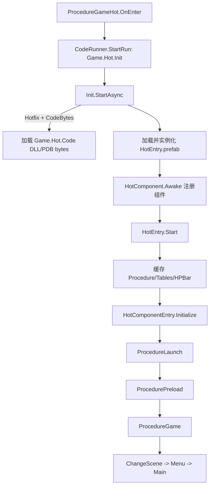

# 模块 03：GameHot 加载层与业务流程

> Catalog ID: `UNITY-02`、`UNITY-03`  
> 状态：`verified`  
> 最后核验：`2026-08-05`  
> 适用模式：GameHot Client

## 模块定位

GameHot 是基于 UnityGameFramework 的纯客户端业务模式。`Game.Hot.Loader` 是随 Player 发布的稳定桥接层，负责加载可选的热更 DLL 和业务入口 prefab；`Game.Hot.Code` 是业务程序集，负责配置、流程、UI、Entity、玩法和运行时组件。

本模块覆盖从 `ProcedureGameHot` 到 GameHot 主玩法的完整入口。UI、Entity、配置表和网络细节由各自模块继续展开。

## 源码边界

| 类型 | 仓库相对路径 | 说明 |
| --- | --- | --- |
| UGF 模式入口 | `Unity/Assets/Scripts/Game/Procedure/ProcedureGameHot.cs` | 调用 CodeRunner |
| 稳定 Loader | `Unity/Assets/Scripts/Game/Hot/Loader/Init.cs` | DLL bytes 与 prefab 加载 |
| 组件基类/注册表 | `Unity/Assets/Scripts/Game/Hot/Loader/Base` | HotComponent 生命周期 |
| 业务入口 | `Unity/Assets/Scripts/Game/Hot/Code/Base/HotEntry.cs` | 初始化、Update、Shutdown |
| 入口 prefab | `Unity/Assets/Res/Hot/HotEntry.prefab` | 实际挂载的业务组件 |
| Procedure | `Unity/Assets/Scripts/Game/Hot/Code/Procedure` | GameHot FSM |
| 玩法 | `Unity/Assets/Scripts/Game/Hot/Code/Game` | GameMode、GameBase、SurvivalGame |
| 玩法模式枚举 | `Unity/Assets/Scripts/Game/Hot/Code/Game/GameMode.cs` | 当前只声明 Survival |
| 生成物 | `Unity/Assets/Scripts/Game/Hot/Code/Generate` | Luban、Proto、UGF ID；禁止手改 |

## 依赖关系

```text
Game + UGF + UnityGameFramework.Extension
  -> Game.Hot.Loader
     -> Game.Hot.Code
        -> UI / Entity / Tables / Network / Resource APIs
```

`Game.Hot.Code.asmdef` 直接引用 `Game.Hot.Loader`，Loader 不反向引用 Code。Code 只在 `UNITY_GAMEHOT` 且满足 `!UNITY_HOTFIX || UNITY_COMPILE || UNITY_EDITOR` 时由 Unity 编译；热更 Player 通过 DLL bytes 装载该程序集。

## 入口与调用链



`HotEntry.prefab` 当前包含：根节点 `HotEntry`，子节点 `Procedure`、`Tables`、`HP Bar`，分别挂载 `HotEntry`、`ProcedureComponent`、`TablesComponent`、`HPBarComponent`。

Procedure 实际链路：

1. `ProcedureLaunch` 注册 Protobuf 自定义对象工厂，下一帧进入 Preload。
2. `ProcedurePreload` 加载全部 GameHot Luban 表、HPBar prefab 和默认字体。
3. `ProcedureGame` 初始化并连接 `NetworkServiceHelper`，设置菜单 SceneId。
4. `ProcedureChangeScene` 停声音、隐藏实体、卸载旧场景、加载 DTScene 指定场景。
5. 菜单场景进入 `ProcedureMenu`；开始游戏后写入主场景 ID 与 `GameMode.Survival`。
6. 主场景进入 `ProcedureMain`，从 FSM 的 `GameMode` byte 取出枚举值并索引 `m_Games`；当前 `GameMode.cs` 只定义 `Survival`，`ProcedureMain.OnInit` 只注册 `SurvivalGame`。
7. `SurvivalGame.GameMode` 返回 `GameMode.Survival`；GameOver 两秒后 `ProcedureMain` 写入菜单场景 ID 并返回菜单。

## 核心类型与 API

| 类型/API | 职责 | 生命周期/约束 |
| --- | --- | --- |
| `Game.Hot.Init` | 加载 DLL bytes 与 HotEntry prefab | 被 CodeRunner 动态添加和销毁 |
| `HotComponent` | GameHot 运行组件基类 | `Awake` 自动注册；同一具体类型只能一个 |
| `HotComponentEntry` | 按 Priority 管理组件 | 高优先级先初始化/更新，关闭时反向遍历 |
| `HotEntry` | GameHot 业务总入口 | `Start` 初始化，`Update` 驱动，`OnDestroy` 关闭 |
| `ProcedureComponent` | 扫描并创建业务 FSM | 只注册直接继承 `ProcedureBase` 的非抽象类 |
| `HotEntry.Tables.LoadAllAsync()` | 加载 GameHot 配置 | 根据生成 `LoadAsync` 签名选择 ByteBuf/JSON |
| `GameMode` | 玩法模式枚举 | 当前只有 `Survival`；必须与 `ProcedureMain` 注册表同步 |
| `GameBase` | 玩法生命周期抽象 | Initialize/Update/Shutdown |
| `SurvivalGame` | 当前生存玩法 | 每秒按表配置生成 Asteroid |

## 数据与生命周期

- `HotComponent.Awake` 在 prefab 实例化时把组件注册到静态链表；重复类型只记录错误，不覆盖旧实例。
- 注册顺序按 `Priority` 降序；当前三个业务 HotComponent 都使用默认值 `0`，相同优先级保持 Awake 注册顺序。
- `HotEntry.Start` 必须先缓存组件，再调用 `Initialize`，最后启动 Procedure。
- `HotEntry.Update` 使用 `Time.deltaTime` 与 `Time.unscaledDeltaTime` 驱动所有组件。
- 关闭时组件按链表逆序执行 `OnShutdown`，随后清空静态注册表，允许下一次重新实例化。
- Procedure FSM 数据保存 `NextSceneId` 和 `GameMode`；场景加载完成事件以 `UserData == this` 过滤自身请求。
- `GameMode` 以 `VarByte` 写入 FSM；`ProcedureMain` 直接用该枚举索引 `m_Games`。新增枚举但未注册对应 `GameBase` 会在进入主场景时找不到玩法实例。
- `ProcedureGame` 的 NetworkService Helper 在 FSM 销毁时释放，因此离开该状态进入场景后网络仍保持连接。

## 开发扩展步骤

### 新增 HotComponent

1. 在 Loader 或 Code 的正确层继承 `HotComponent`；只把必须稳定存在的桥接类型放 Loader。
2. 需要固定顺序时重写 `Priority`，值越大越早初始化和更新、越晚关闭。
3. 把组件挂到 `Unity/Assets/Res/Hot/HotEntry.prefab`。
4. 在 `HotEntry.InitComponents()` 获取并暴露组件。
5. 实现 `OnInitialize`、`OnUpdate`、`OnShutdown`，确保重复进入 GameHot 后静态状态可重新初始化。

### 新增 Procedure

1. 在 `Game/Hot/Code/Procedure` 创建直接继承 `ProcedureBase` 的非抽象类。
2. 无需手工注册；`ProcedureComponent.OnInitialize` 会扫描当前执行程序集。
3. 使用 FSM 的 `SetData/GetData` 传递跨状态参数，并在所有入口写入必需键。
4. 事件订阅必须在离开状态或销毁时对应取消。

### 新增 GameMode

1. 在 `Unity/Assets/Scripts/Game/Hot/Code/Game/GameMode.cs` 扩展枚举值；当前源码只有 `Survival`。
2. 实现新的 `GameBase` 子类，并让 `GameMode` 属性返回新枚举值。
3. 在 `ProcedureMain.OnInit` 注册实例，否则 `m_Games[gameMode]` 无法解析。
4. 从菜单或其他入口写入 `GameMode` FSM 数据；示例是 `ProcedureMenu` 写入 `(byte)GameMode.Survival`。
5. 保证 `Shutdown` 释放事件、实体和玩法状态。

## 约束与常见错误

- `HotEntry.prefab` 缺少组件时，`HotEntry` 静态属性为空，Preload 会产生空引用。
- 热更 DLL 与 PDB 必须按 `AssetUtility.GetGameHotAsset("Code/...")` 的资源路径构建。
- `ProcedureComponent` 只判断 `BaseType == typeof(ProcedureBase)`；多一层继承的具体 Procedure 不会被自动注册。
- `ProcedureChangeScene` 找不到 DTScene 时只记录 Warning 并停留在当前状态，新增场景必须先完成表配置与资源收集。
- `ProcedurePreload` 使用 `UniTaskVoid.Forget()`，异常会走 UniTask 异常通道；异步资源失败需要在各加载 API 层可观察。
- `GameBase.Initialize` 找不到 `ScrollableBackground` 会提前返回，场景 prefab 必须提供该组件和边界引用。
- `GameMode`、`GameBase` 子类、`ProcedureMain.OnInit` 注册和菜单入口必须成组修改；只增加枚举或只写菜单数据会在主场景入口暴露为未注册玩法。
- `Generate/` 下代码来自 Luban/Proto/UGF 生成流程，禁止手改。

## 验证方法

1. 启用 `UNITY_GAMEHOT`，执行 Define Symbol Refresh 并等待 Unity 编译。
2. 非 Hotfix 模式运行 Launcher，确认依次输出 Game.Hot Start、Load Config，并进入 Menu。
3. 启用 Hotfix 与 Editor CodeBytes，重新编译 DLL，确认从 bytes 启动同一流程。
4. 从 Menu 开始 Survival，验证主场景、玩家 Entity、每秒 Asteroid 和 GameOver 返回菜单。
5. 重复进入/退出 GameHot，确认没有重复 HotComponent、事件订阅或 FSM 残留。
6. 刻意移除一个测试场景配置或资源时，确认错误定位到 DTScene/资源加载而非静默卡死。

本次已完成 Loader、入口 prefab、HotComponent 管理、Procedure、GameMode 枚举和 SurvivalGame 的静态源码核验。运行验证需在 Unity 环境执行。

## 源码证据

- `Unity/Assets/Scripts/Game/Procedure/ProcedureGameHot.cs`：CodeRunner 启停 GameHot。
- `Unity/Assets/Scripts/Game/Hot/Loader/Init.cs`：DLL bytes 与 HotEntry prefab 加载/卸载。
- `Unity/Assets/Res/Hot/HotEntry.prefab`：实际组件组成。
- `Unity/Assets/Scripts/Game/Hot/Loader/Base/HotComponentEntry.cs`：唯一性、优先级、更新和反向关闭。
- `Unity/Assets/Scripts/Game/Hot/Code/Base/HotEntry.cs`：业务初始化顺序。
- `Unity/Assets/Scripts/Game/Hot/Code/Procedure/ProcedureComponent.cs`：Procedure 扫描与 FSM 创建。
- `Unity/Assets/Scripts/Game/Hot/Code/Procedure/ProcedurePreload.cs`：表、HPBar 与字体预载。
- `Unity/Assets/Scripts/Game/Hot/Code/Procedure/ProcedureChangeScene.cs`：场景事件与切换规则。
- `Unity/Assets/Scripts/Game/Hot/Code/Procedure/ProcedureMain.cs`：GameMode 生命周期。
- `Unity/Assets/Scripts/Game/Hot/Code/Game/GameMode.cs`：当前玩法模式枚举值。
- `Unity/Assets/Scripts/Game/Hot/Code/Game/GameBase.cs`：玩法初始化、实体事件订阅和失败日志。
- `Unity/Assets/Scripts/Game/Hot/Code/Game/SurvivalGame.cs`：当前玩法真实调用。

## 关联知识

- 上游：`ARCH-02` 模式和热更程序集边界。
- 下游：`UNITY-04` UI、`UNITY-06` Entity、`UNITY-15` 配置表。
- 下游：`DATA-02` GameHot Proto、`BUILD-01` 热更构建。
- 对照：`ET-02`、`ET-03` ET 客户端入口。
