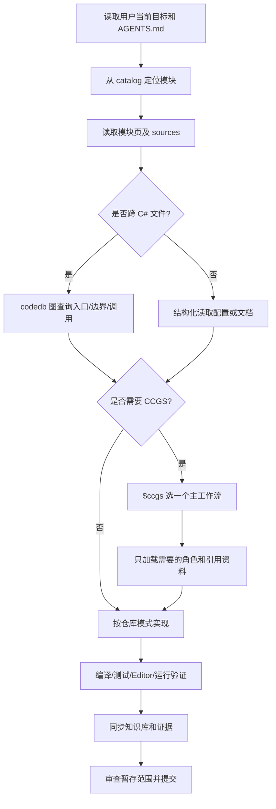

# 模块 28：AI 开发工作流与 CCGS 协作

> Catalog ID: `AI-01`、`AI-02`
> 状态：`verified`  
> 最后核验：`2026-08-04`  
> 适用模式：Shared / GameHot / ET Client / ET Server / Editor

## 模块定位

本模块定义 AI 在 GameDevelopmentKit 中从接收需求、检索知识、审查源码、选择 CCGS 工作流、并行协作、驱动 Unity、验证到提交的统一路径。`AI-01` 负责仓库指令、KnowledgeBase Loop 与工具路由；`AI-02` 负责 CCGS Codex 适配、工作流与角色协作。

CCGS 在本仓库中是“工作流和专家审查资料库”，不是第二套构建系统，也不是 49 个常驻智能体。它不能覆盖 `AGENTS.md`、当前源码、运行证据或 Codex 的系统/权限规则。

## 源码边界

| 类型 | 仓库相对路径 | 说明 |
| --- | --- | --- |
| 仓库级指令 | `AGENTS.md` | 工程架构、开发入口、UI/Entity 流程与 Unity Agent Bridge 强制协议 |
| AI 知识入口 | `KnowledgeBase/catalog.json`、`KnowledgeBase/README.md` | 模块检索、文档导航与完成状态 |
| 知识维护协议 | `KnowledgeBase/LOOP.md`、`KnowledgeBase/_template.md` | 单轮建设、`verified` 准入与页面结构 |
| 静态/运行门禁 | `KnowledgeBase/Test-KnowledgeBase.ps1`、`KnowledgeBase/runtime-acceptance.json`、`KnowledgeBase/source-fingerprints.json` | 指纹、覆盖率、链接、静态完成和五项运行验收 |
| codedb 配置 | `.codedb-mcp/codedb-mcp.toml` | 当前仓库 C# 索引配置；源码调用链优先走图证据 |
| 插件注册 | `.agents/plugins/marketplace.json`、`plugins/ccgs-codex/.codex-plugin/plugin.json` | 本地 CCGS Codex 插件位置、能力与技能目录 |
| CCGS 入口 | `plugins/ccgs-codex/skills/ccgs/SKILL.md` | `$ccgs` 的路由、执行和专家协作规则 |
| 兼容层 | `plugins/ccgs-codex/skills/ccgs/references/compatibility.md` | Claude 工具语义到 Codex 的翻译与优先级 |
| CCGS 评审模式 | `plugins/ccgs-codex/skills/ccgs/references/studio/director-gates.md`、`production/review-mode.txt` | `full`/`lean`/`solo` gate 规则；当前仓库全局值为 `lean` |
| 索引 | `plugins/ccgs-codex/skills/ccgs/references/workflow-index.md`、`plugins/ccgs-codex/skills/ccgs/references/role-index.md` | 73 个工作流、49 个角色视角，按需加载 |
| 生产状态 | `production/review-mode.txt`、`production/session-state/active.md` | CCGS 当前评审模式和活动阶段；只在任务确实使用时更新 |
| Unity 包声明 | `Unity/Packages/manifest.json`、`Unity/Packages/packages-lock.json` | 声明 `me.xw.unityagentbridge` 依赖及锁定 hash；不等同于当前 Editor 在线 |
| Unity 工程版本 | `Unity/ProjectSettings/ProjectVersion.txt` | 当前工程实际 Unity 版本；优先级高于 `AGENTS.md` 中可能滞后的前置说明 |

`plugins/ccgs-codex/skills/ccgs/references/workflows`、`plugins/ccgs-codex/skills/ccgs/references/roles`、`plugins/ccgs-codex/skills/ccgs/references/studio`、`plugins/ccgs-codex/skills/ccgs/references/standards` 是从上游同步的参考资料。修改适配能力时应改入口、兼容层或同步脚本，不在大量导入文件中散改同一规则。

## 依赖关系

### 指令优先级

```text
Codex system / developer / sandbox / approval
  > 当前目录生效的 AGENTS.md
  > 用户当前请求与已批准产品决策
  > 当前源码、配置、测试和运行证据
  > $ccgs 适配入口与 compatibility.md
  > 导入的 CCGS workflow / role / standards
```

低优先级资料与高优先级来源冲突时，忽略冲突部分并保留可用意图。例如导入工作流中的 `Task`、`subagent_type`、Claude 模型名、Bash 工具白名单、逐文件审批和根 `src/` 假设都不能直接执行。

### 工具路由

| 问题 | 首选工具 | 升级条件 |
| --- | --- | --- |
| C# 跨文件调用、dispatch、共享状态和入口链 | codedb-mcp 图查询 | 图无法表达局部语义时再读精确 symbol/range |
| Markdown、JSON、manifest、PowerShell/BAT | 结构化解析或 `rg`/精确读取 | 不用 C# 调用图猜配置语义 |
| Unity Editor 查询/修改 | Unity Agent Bridge | 先读安装包 `AGENT.md`、`list_commands`，确认宿主在线 |
| 独立审查或实现范围 | Codex 多智能体 | 只有作用域互不重叠、输出契约明确时并行 |
| 构建、导表、Proto、服务端 | 仓库真实命令 | 以退出码、日志和产物为证据 |

## 入口与调用链

### 标准 AI 开发链



### KnowledgeBase Loop

```text
选择 planned/seed 缺口
  -> 确定程序集、入口、依赖、生成物和真实调用
  -> 阅读源码并编写固定模板
  -> 逐项交叉核验
  -> verified
  -> 刷新源码指纹
  -> 普通校验 + RequireStaticComplete
  -> 提交
  -> 下一轮重新读取源码状态
```

静态完成与运行完成是两个状态。`verified` 只表示源码与文档已过静态门禁；客户端启动、服务端启动、Luban、Proto 和目标 Player 构建全部真实执行并写入 `KnowledgeBase/runtime-acceptance.json` 后，才可以运行 `-RequireComplete` 并声明全流程完成。

### `$ccgs` 路由

1. 读取 `AGENTS.md` 和 `plugins/ccgs-codex/skills/ccgs/references/compatibility.md`。
2. 从 `plugins/ccgs-codex/skills/ccgs/references/workflow-index.md` 选择一个最小主工作流；用户点名工作流时直接采用，除非冲突。
3. 只加载该工作流文件，不把 73 个工作流全部放进上下文。
4. 从 `plugins/ccgs-codex/skills/ccgs/references/role-index.md` 选择完成当前步骤所需的角色视角；角色提示是审查 lens，不是自动获得的智能体。
5. 需要并行时，把独立范围交给真实可用的 Codex agents；否则由主智能体顺序执行同样的审查视角。
6. 若所选 workflow 引用 studio 或 standards 资料，使用完整仓库相对路径加载对应文件，例如 `plugins/ccgs-codex/skills/ccgs/references/studio/director-gates.md`；不要沿用导入提示中的短 `references/...` 当成仓库根路径。
7. 最终以仓库约束、产品目标、源码、测试和运行结果解决角色分歧。

## 核心类型与 API

| 类型/API | 职责 | 生命周期/约束 |
| --- | --- | --- |
| `KnowledgeBase/catalog.json` | 模块 ID、area、关键词、文档和权威 sources | 开发前检索，模块边界变化时同步更新 |
| `KnowledgeBase/LOOP.md` | 知识建设状态机与 `verified` 准入 | 每轮知识任务都执行，不以旧结论代替复核 |
| `KnowledgeBase/Test-KnowledgeBase.ps1` | 页面、Catalog、指纹、链接和验收门禁 | `-RefreshSourceFingerprints` 只在完成源码审查后执行 |
| `$ccgs` | 单一 Codex-native CCGS 路由技能 | 一次选择一个主工作流 |
| `plugins/ccgs-codex/skills/ccgs/references/compatibility.md` | 指令优先级、Claude 工具翻译和协作契约 | 每次使用导入工作流前读取 |
| `plugins/ccgs-codex/skills/ccgs/references/workflow-index.md` | 73 个工作流的可检索索引 | 按任务阶段加载一个工作流 |
| `plugins/ccgs-codex/skills/ccgs/references/role-index.md` | 49 个专家角色的可检索索引 | 只加载能改变当前决策的角色 |
| `production/review-mode.txt` | CCGS 评审模式 | 当前为 `lean`；只影响 director/lead gate 是否生成，不会跳过用户显式请求的 `$ccgs code-review` 或 Codex code-review stance |
| `plugins/ccgs-codex/skills/ccgs/references/workflows/code-review.md` | CCGS 代码评审 workflow | read-only workflow；输出 findings、testability、ADR、standards、architecture、SOLID 和 verdict，不写文件 |
| Unity Agent Bridge `list_commands` | 当前 Editor 会话的命令/schema/batch policy | session 首次调用；版本或扩展状态变化、`UNKNOWN_COMMAND` 时刷新 |

Claude 到 Codex 的主要翻译：

| 导入术语 | Codex 执行语义 |
| --- | --- |
| `/workflow-name` | 调用 `$ccgs` 并选择对应 workflow，或用自然语言点名 |
| `AskUserQuestion` | 只在产品、架构、破坏性操作、凭据或权限真正阻塞时直接提问 |
| `Task` / `subagent_type` | 使用实际可用的 Codex 多智能体，或主智能体顺序角色审查 |
| `Read` / `Glob` / `Grep` | 使用文件工具；文本检索优先 `rg` |
| `Write` / `Edit` | 在当前权限和仓库规则下编辑 |
| `Bash` | 使用工作区平台原生命令；本仓库默认 PowerShell |
| `model: opus/sonnet/haiku` | 忽略；模型路由由 Codex 决定 |
| Claude hooks | 转成显式验证清单，不宣称 Codex hook 已安装 |

## 数据与生命周期

### 单任务所有权

- 主任务持有最终目标、产品决策、共享文件、Catalog、验证、暂存和提交；其他 session 或 worker 的自述不能替代主任务复核。
- 子智能体只持有提示中明确的只读审查或不重叠写入范围，返回结论、问题、路径和行号；不能修改共享目录、暂存文件、提交、刷新指纹或顺手清理工作区。
- 共享文档由一个集成者写入。并行结果先去重，再按指令、源码和证据解决冲突；多数意见不是正确性证明。
- 多 session 同时工作时，`production/`、`KnowledgeBase/`、`Unity/.agentbridge/` fixed slot 和 Git index 都视为共享状态。只有当前任务明确拥有的文件才可写入或暂存；看到其他任务的未提交改动时保持原状。
- 若外部改动影响权威源指纹，在干净 worktree 或隔离快照验证本任务，不能刷新基线吸收外部产物。

### 证据状态

| 状态 | 可声明内容 |
| --- | --- |
| 静态阅读 | “源码/配置显示该链路或约束” |
| 编译成功 | “指定解决方案/程序集在该 revision 编译成功” |
| Editor 操作 | “通过 Bridge 在指定 Unity 会话执行并得到响应” |
| 运行验证 | “指定客户端/服务端/生成/构建流程实际成功” |
| 主观审查 | “画面、手感或可用性审查结论”，附截图/录屏与审查人，不冒充自动测试 |

`story-done` 等导入工作流可以生成建议的 Git 命令，但不会替代当前任务的提交权限和范围审查。是否提交由用户请求与当前协作规则决定；提交前仍需检查 staged diff。

## 开发扩展步骤

### 普通功能任务

1. 读取当前 `AGENTS.md`，用 Catalog 关键词定位模块页和 sources。
2. 读取入口、核心接口、生命周期、配置和一处真实调用；C# 跨文件事实用 codedb 图闭合。
3. 若需求适合 CCGS，选择一个主 workflow；只加载必要角色，不把全量资料塞入上下文。
4. 把实现拆成不重叠的所有权范围。共享文件由主任务或唯一 worker 修改。
5. 按仓库现有模式实现，保留热更、客户端/服务端、条件编译和生成边界。
6. 运行最贴近修改的编译/测试/Editor/运行验证，保存命令、退出码、日志或截图。
7. 入口、约束或流程变化时同步 KnowledgeBase；审查 source fingerprints 后运行静态门禁。
8. `git diff --cached --name-only` 和 cached diff 只包含本任务文件后再提交。

### 模块会话与单次评审

1. 可独立建设的知识模块分别交给独立实现会话；每个会话只写自己的页面或明确分配的非共享文件，并提交可审查结果。
2. 每个实现会话完成后，为该模块新建一个独立、只读的 review 会话，检查规格覆盖、源码证据、过度推断、扩展步骤和验证边界。
3. 默认每个模块只做这一轮 review，不自动启动三重审查。用户明确要求更高审查级别时，才增加第二轮、第三轮或专项角色评审。
4. review 发现明确问题后由主任务修复；若结论存在事实争议，再为该具体问题新建只读讨论或仲裁 agent，同时给出双方源码证据，不扩大成全量重复评审。
5. 主任务负责合并、目录和指纹等共享文件，修复后重新执行门禁；不能用“已讨论”替代问题关闭证据。

### Unity Agent Bridge

1. 从当前目录及父级寻找 Unity 工程，必要时再扫描子目录。本仓库 Unity 工程根为 `Unity/`，因此应寻找同时包含 `Unity/Assets/` 与现有 `Unity/.agentbridge/` 的目录；找不到时停止并报告 Unity 没有安装或运行 AgentBridge，不自行创建目录。
2. 读取当前已安装 Unity 包中的 canonical `AGENT.md`；该文件由 Unity Package Manager 解析到 `Unity/Library/PackageCache` 或 `Unity/Packages`，不把本机缓存绝对路径写成仓库常量。若当前 worktree 只有 `Unity/Packages/manifest.json` 和 `Unity/Packages/packages-lock.json`，只能证明包依赖被声明，不能证明包已安装或 Editor 在线。
3. session 首次请求必须是 `list_commands`；命令、参数 schema、`batchAllowed`、`supportsUndoCollapse` 和 `commandsVersion` 只取运行时返回，不硬编码旧清单或源码文件名。
4. 单次请求使用全新非空 id，并先写 Bridge root 的 `request.json.tmp`，再原子 rename 为 `request.json`；以本仓库默认位置为例即 `Unity/.agentbridge/request.json.tmp` 到 `Unity/.agentbridge/request.json`。fixed slot 未完成 ack 前不发送下一条。
5. 写入前确认没有上一轮未确认的 `Unity/.agentbridge/response.json`；响应出现后一次性完整读入，核对 id，处理 `status`、`result`、`error`，并比较 `commandsVersion`。
6. 完整读取 `Unity/.agentbridge/response.json` 后等待 Unity 删除 `Unity/.agentbridge/processing.json`，等待期间必须保留响应；`processing.json` 消失后显式删除 `response.json` 作为 ack，并确认删除成功后才允许写下一条请求。
7. 只有响应 `commandsVersion` 与缓存不同、Unity 中装卸/启停扩展或收到 `UNKNOWN_COMMAND` 时重新执行 `list_commands`；不要每条命令前重复 discovery。
8. `INVALID_PARAMS` 按缓存 schema 修正后换新 id；`INTERRUPTED` 表示副作用状态未知，先查询实际状态；`RESPONSE_TOO_LARGE` 缩小范围后换新 id。
9. 修改后读取响应、日志和必要截图；`Unity/.agentbridge/` 目录存在不证明宿主在线，只有真实成功响应才能记录 Editor 验证。

## 约束与常见错误

- 不把 73 个 workflow 当成 73 个独立 Codex skills；当前可调用入口是一个 `$ccgs`。
- 不把 49 个 role prompts 称为 49 个已启动 subagents；它们是按需加载的审查视角。
- 不直接执行导入 prompt 中的 Claude `Task`、模型字段、hooks、Bash allowlist 或 slash-command 链。
- 不套用导入资料的根 `src/`、根 `tests/`、Godot/Unreal 默认目录；保留本仓库 `Unity/`、`DotNet/`、`Share/`、`Design/` 和 `production/` 结构。
- 不把 CCGS phase gate 的建议语义升级为高于用户决策和仓库规则的绝对阻断；真正阻断项来自当前指令、构建、测试、安全和数据风险。
- `production/review-mode.txt` 为 `lean` 时，只按当前 workflow 的 gate 规则跳过非 PHASE-GATE director/lead gate；用户显式选择 `$ccgs code-review`、导入 workflow 要求 `/code-review` 或上级规则要求 code review 时仍必须执行评审。
- `AGENTS.md` 中工具版本可能滞后于工程文件；实际 Unity 版本以 `Unity/ProjectSettings/ProjectVersion.txt` 为准，并在发现偏差时更新文档。
- 不看到 `Unity/.agentbridge/` 就声明 Unity 已连接；不读取旧响应就覆盖 fixed slot；不在未读安装包 `AGENT.md` 时发送命令。
- 不用静态源码、空日志或 agent 自述冒充运行通过；主任务必须复核可重复证据。
- 不在脏工作区运行全量 source fingerprint 刷新后直接提交，否则会把其他任务产物固化为知识基线。

## 验证方法

### 建议步骤

```powershell
# CCGS inventory
(Get-ChildItem plugins/ccgs-codex/skills/ccgs/references/workflows -File -Filter *.md).Count
(Get-ChildItem plugins/ccgs-codex/skills/ccgs/references/roles -File -Filter *.md).Count

# Single document structure and links
Select-String -Path KnowledgeBase/28-AI开发工作流与CCGS协作.md -Pattern '^# 模块|^## '

# KnowledgeBase gates
powershell -ExecutionPolicy Bypass -File KnowledgeBase/Test-KnowledgeBase.ps1
powershell -ExecutionPolicy Bypass -File KnowledgeBase/Test-KnowledgeBase.ps1 -RequireStaticComplete

# Commit scope
git status --short
git diff --cached --name-only
git diff --cached --check
```

涉及 Unity 时另按安装包协议执行 `list_commands`、具体查询/修改和响应 ack；涉及服务端、Luban、Proto 或 Player 时运行对应真实命令并更新 `runtime-acceptance.json`。

### 本轮实际执行结果

- 已实测 CCGS `workflows` 为 73 个、`roles` 为 49 个；索引与文件数量一致。
- 已静态核验插件 manifest、`$ccgs` 路由、compatibility、director gates、`code-review` workflow、KnowledgeBase Loop、Bridge 仓库指令、Unity 包声明和 lean review 配置。
- `Unity/Packages/manifest.json` 与 `Unity/Packages/packages-lock.json` 声明并锁定 `me.xw.unityagentbridge`；当前 worktree 没有 `Unity/.agentbridge/` Bridge root，也没有 `Unity/Library/PackageCache`，因此本轮没有可用的本机安装包路径或在线 Editor 会话可声明。
- 发现 `AGENTS.md` 的 Unity 前置版本为 `6000.3.18f1`，而 `Unity/ProjectSettings/ProjectVersion.txt` 为 `6000.3.21f1`；后续环境判断以工程文件为准。
- 本文档单文件结构与 Markdown 链接检查通过；`KnowledgeBase/Test-KnowledgeBase.ps1` 与 `-RequireStaticComplete` 当前失败在 15 个非本文件模块的 source fingerprint drift 上，本轮按范围约束未刷新 `KnowledgeBase/source-fingerprints.json`。
- 本轮没有向 Unity Bridge 发送命令，没有执行客户端、服务端、Luban、Proto 或 Player 构建；运行验收仍为 `not_run`。

## 源码证据

- `plugins/ccgs-codex/skills/ccgs/references/compatibility.md:5`：指令优先级、工具翻译和多智能体契约。
- `plugins/ccgs-codex/skills/ccgs/SKILL.md:10`：读取顺序、主工作流路由、执行和专家协作。
- `plugins/ccgs-codex/skills/ccgs/references/workflow-index.md:7`、`plugins/ccgs-codex/skills/ccgs/references/role-index.md:7`：73 个工作流与 49 个角色索引。
- `plugins/ccgs-codex/skills/ccgs/references/studio/director-gates.md:17`：`full`、`lean`、`solo` 的 gate 运行规则和 PHASE-GATE 例外。
- `plugins/ccgs-codex/skills/ccgs/references/workflows/code-review.md:166`：`code-review` workflow 是只读审查，不写文件。
- `.agents/plugins/marketplace.json:6`、`plugins/ccgs-codex/.codex-plugin/plugin.json:13`：本地插件注册、技能目录和能力声明。
- `KnowledgeBase/LOOP.md:7`、`KnowledgeBase/LOOP.md:43`：单轮流程；静态完成与五项运行完成边界。
- `AGENTS.md:370`、`AGENTS.md:372`：Unity 操作前读取安装包协议、唯一 id、single-flight、`list_commands` 和 ack 要求。
- `Unity/Packages/manifest.json:31`、`Unity/Packages/packages-lock.json:339`、`Unity/Packages/packages-lock.json:347`：Unity Agent Bridge 包依赖声明和锁定来源；只证明依赖配置，不证明 Editor 在线。
- `Unity/ProjectSettings/ProjectVersion.txt:1`：当前 Unity 工程版本。
- `production/review-mode.txt:1`：当前 CCGS review mode 为 `lean`。
- `.codedb-mcp/codedb-mcp.toml`：本仓库 C# 图索引配置入口。

## 关联知识

- 上游：`ARCH-01` [仓库架构](01-总体架构与启动流程.md)，`ARCH-02` [模式与程序集边界](02-模式选择与代码分层.md)。
- 下游：`UNITY-17`、`UNITY-18` [Unity 运行链](29-Unity运行链路.md)；`SERVER-04`、`SERVER-05` [ET 服务端运行链](30-ET服务端运行链路.md)。
- 下游：`CODE-01`、`CODE-02`、`CODE-03` [脚本规范与验证要求](31-脚本编写规范.md)。
