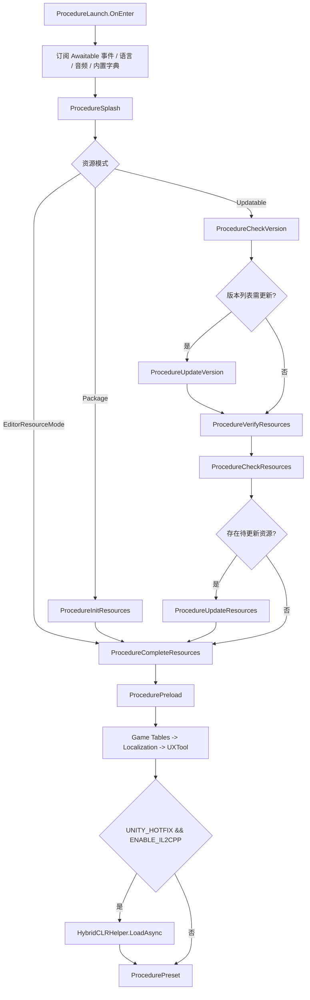
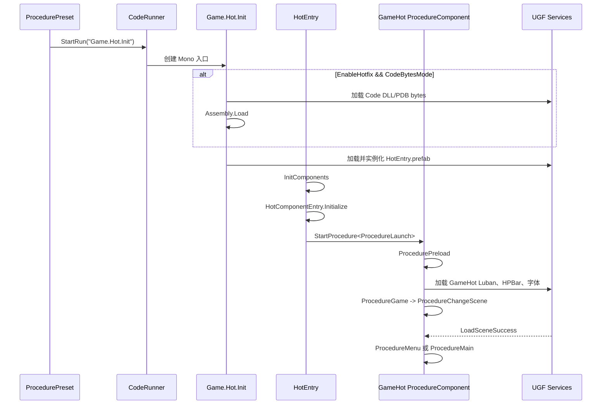
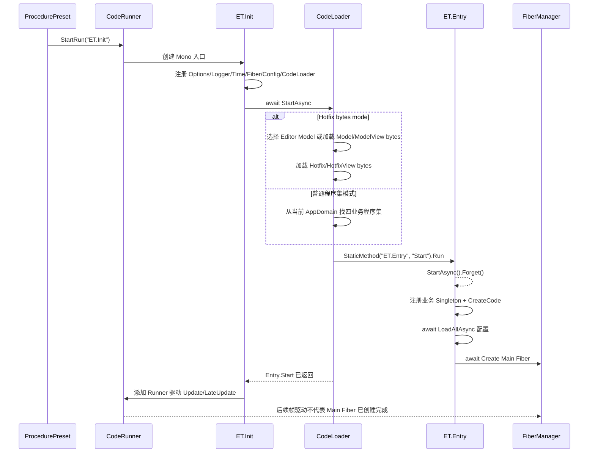

# 模块 29：Unity 运行链路

> Catalog ID: `UNITY-17`、`UNITY-18`
> 状态：`verified`  
> 最后核验：`2026-08-04`  
> 适用模式：Unity Runtime / GameHot / ET Client / Editor / Player

## 模块定位

本文串联 Unity 从基础 Procedure 启动到业务真正可用的跨模块时序。`UNITY-17` 覆盖公共启动、资源就绪、模式分派与 GameHot/ET Loader；`UNITY-18` 覆盖配置、UI、Entity、场景和业务状态的运行编排。

本文只描述跨模块“何时发生、谁持有状态、什么条件才能继续”。UIForm、Entity、AssetSet、场景、Luban、HybridCLR 和 ET 内部 API 仍由对应主题页负责。

## 源码边界

| 类型 | 仓库相对路径 | 说明 |
| --- | --- | --- |
| 公共启动 | `Unity/Assets/Scripts/Game/Procedure/ProcedureLaunch.cs`、`Unity/Assets/Scripts/Game/Procedure/ProcedureSplash.cs` | 公共设置、Awaitable 事件、资源模式分支 |
| 资源准备 | `Unity/Assets/Scripts/Game/Procedure/ProcedureInitResources.cs`、`Unity/Assets/Scripts/Game/Procedure/ProcedureCheckVersion.cs`、`Unity/Assets/Scripts/Game/Procedure/ProcedureUpdateVersion.cs`、`Unity/Assets/Scripts/Game/Procedure/ProcedureVerifyResources.cs`、`Unity/Assets/Scripts/Game/Procedure/ProcedureCheckResources.cs`、`Unity/Assets/Scripts/Game/Procedure/ProcedureUpdateResources.cs`、`Unity/Assets/Scripts/Game/Procedure/ProcedureCompleteResources.cs` | Package/Updatable/Editor 三种路径收束 |
| 公共预加载 | `Unity/Assets/Scripts/Game/Procedure/ProcedurePreload.cs` | Game 表、本地化、UXTool、HybridCLR |
| 模式分派 | `Unity/Assets/Scripts/Game/Procedure/ProcedurePreset.cs` | `UNITY_ET` / `UNITY_GAMEHOT` / 基础 Game 条件编译分支 |
| GameHot 入口 | `Unity/Assets/Scripts/Game/Procedure/ProcedureGameHot.cs`、`Unity/Assets/Scripts/Game/Hot/Loader/Init.cs` | CodeRunner、业务 DLL bytes 与 HotEntry prefab |
| GameHot 业务 | `Unity/Assets/Scripts/Game/Hot/Code/Base/HotEntry.cs`、`Unity/Assets/Scripts/Game/Hot/Code/Procedure`、`Unity/Assets/Scripts/Game/Hot/Code/Tables/TablesComponent.Load.cs`、`Unity/Assets/Scripts/Game/Hot/Code/Game` | 第二层 FSM、业务表、UI、场景与实体 |
| ET 入口 | `Unity/Assets/Scripts/Game/Procedure/ProcedureET.cs`、`Unity/Assets/Scripts/Game/ET/Loader/Init.cs`、`Unity/Assets/Scripts/Game/ET/Loader/CodeLoader.cs` | Unity Mono 壳、四程序集、ET World 与 Runner |
| ET 业务启动 | `Unity/Assets/Scripts/Game/ET/Code/Model/Share/Entry.cs` | CodeTypes、配置、Main Fiber |
| 稳定服务 | `Unity/Assets/Scripts/Game/Base`、`Unity/Assets/Scripts/Library/UGF` | UGF Resource/UI/Entity/Scene/Event/CodeRunner 运行服务 |

## 依赖关系

```text
UGF Procedure FSM
  -> 公共资源与配置就绪
  -> ProcedurePreset
     -> UNITY_GAMEHOT: CodeRunner -> Game.Hot.Init -> HotEntry -> GameHot FSM
     -> UNITY_ET:      CodeRunner -> ET.Init -> CodeLoader -> ET.Entry.Start
                         -> Entry.StartAsync().Forget() -> Config/Main Fiber
     -> neither:       ProcedureGame
```

- `ProcedurePreset` 通过 `#if UNITY_ET / #elif UNITY_GAMEHOT` 固化互斥分支，不是运行时菜单选择。
- GameHot Loader 是稳定程序集，负责加载/实例化 HotEntry；HotEntry 所在 Code 程序集反向依赖 Loader，但 Loader 不持有业务类型之外的业务生命周期。
- ET Loader 是 Unity 与 ET World 的稳定桥；Model/Hotfix/ModelView/HotfixView 的装载组合受 `UNITY_HOTFIX`、Editor Model DLL 设置和 CodeRunner bytes mode 共同决定。
- ET Entry 有二次异步分叉：`Unity/Assets/Scripts/Game/ET/Loader/Init.cs` 的 `Start()` 用 `.Forget()` 启动 Loader，`Unity/Assets/Scripts/Game/ET/Code/Model/Share/Entry.cs` 的 `Start()` 又用 `.Forget()` 启动配置加载和 Main Fiber 创建；Runner 只等待到 CodeLoader 返回，不等待配置或 Main Fiber 完成。
- 公共预加载先于两种业务模式，GameHot 自己还会执行一次业务表和字体预加载；不要把两层 `ProcedurePreload` 当成同一个类型或同一套 FSM。

## 入口与调用链

### 公共启动与资源就绪



关键事实：

1. `ProcedureLaunch.OnEnter` 订阅 Awaitable 事件并初始化语言、声音和内置字典；`OnDestroy` 才取消订阅。下一帧进入 `ProcedureSplash`。
2. `ProcedureSplash` 按 `EditorResourceMode`、`ResourceMode.Package`、其他可更新模式选择不同路径。
3. Updatable 路径的 `ProcedureCheckVersion` 成对订阅 WebRequest 事件；成功响应解析 `VersionInfo`，强更时打开内置对话框，否则选择更新版本列表或校验资源。失败只记录 warning，`m_CheckVersionComplete` 不会被置 true，流程不会自动前进。
4. `ProcedureUpdateVersion` 完成后必须进入 `ProcedureVerifyResources`，再经 `ProcedureCheckResources` 判断是否需要 `ProcedureUpdateResources`；不能把版本列表更新直接画成资源更新或完成。`ProcedureUpdateResources` 成对订阅四类资源更新事件，更新成功回调才允许进入 `ProcedureCompleteResources`；最终失败记录 error，保持当前状态。
5. `ProcedureCompleteResources.OnEnter` 调用 `SaveLauncherResourcePathAsync().Forget()` 后立即切换到公共 `ProcedurePreload`。Launcher 路径保存不是同步闸门，后续代码不能假定该异步任务已完成。
6. 公共 `ProcedurePreload` 依次 await Game Tables、本地化、UXTool；仅 `UNITY_HOTFIX && ENABLE_IL2CPP` 下加载 HybridCLR，然后进入 `ProcedurePreset`。Editor 还校验 UIGroup/EntityGroup 配置引用。

### GameHot 业务链



GameHot 真实业务可用点：

- Loader 在热更 bytes 模式按资源名加载 `Game.Hot.Code.dll.bytes` 与 PDB；无该条件时使用 Unity 已编译程序集，然后始终加载 `Unity/Assets/Res/Hot/HotEntry.prefab`。
- `HotEntry.Start` 获取 Procedure/Tables/HPBar 组件，初始化 HotComponentEntry，启动 GameHot `ProcedureLaunch`；`Update` 驱动 HotComponentEntry，销毁时 Shutdown。
- GameHot `ProcedureComponent.OnInitialize` 扫描当前业务程序集内直接继承 `ProcedureBase` 的具体类，创建自己的 FSM；它与 UGF 公共 Procedure FSM 独立。
- GameHot `ProcedurePreload` await Luban 表、HPBar 和默认字体，之后 `ProcedureGame` 初始化 NetworkService 并把菜单场景 ID 写入 FSM data。
- `ProcedureChangeScene` 先停声音、隐藏 Entity、卸载已加载场景、恢复游戏速度，再按 `DTScene` 调 UGF LoadScene；成功事件置完成标记并播放背景音乐，随后进入 Menu 或 Main。
- `ProcedureMenu` 订阅 `OpenUIFormSuccess`，调用 `GameEntry.UI.OpenUIForm(UIFormId.MenuForm, this)`；开始游戏时写入主场景与 `GameMode.Survival`。
- `ProcedureMain` 根据 FSM data 选择 `SurvivalGame`；`GameBase.Initialize` 查找场景边界并显示玩家 Entity，`SurvivalGame.Update` 定时显示小行星 Entity。离开 Main 时 Shutdown 并释放事件订阅。

### ET 客户端链



`Unity/Assets/Scripts/Game/ET/Loader/Init.cs` 的 `Start()` 在第 55 行调用 `StartAsync().Forget()`；`StartAsync` 在第 88 行只 `await CodeLoaderComponent.Instance.StartAsync()`，第 89 行随即添加 `Runner`。`Unity/Assets/Scripts/Game/ET/Loader/CodeLoader.cs` 的 `StartAsync` 会完成程序集选择和 bytes 加载，然后在第 92-93 行反射执行 `ET.Entry.Start`；而 `Unity/Assets/Scripts/Game/ET/Code/Model/Share/Entry.cs` 的 `Start()` 在第 26 行再次 `StartAsync().Forget()`，第 48 行配置加载和第 50 行 Main Fiber 创建不被 CodeLoader 或 Runner 等待。

因此，程序集选择、bytes 加载或 `ET.Entry.Start` 反射调用本身的异常会阻止 `Runner` 添加；但 `ET.Entry.StartAsync` 分叉后的配置或 Main Fiber 失败不会阻止 `Runner` 进入帧驱动，只会让 ET 业务未真正就绪。`ProcedureET.OnLeave` 调 StopRun，Runner 销毁时发布 `OnShutdown` 并 Dispose ET World。

## 核心类型与 API

| 类型/API | 职责 | 生命周期/线程约束 |
| --- | --- | --- |
| `ProcedureLaunch` | 公共设置与 Awaitable 事件入口 | UGF Procedure 创建至销毁；订阅在 OnDestroy 释放 |
| `ProcedureSplash` | 选择 Editor/Package/Updatable 资源链 | 每次进入按当前 ResourceMode 分支 |
| `ProcedurePreload`（Game） | 表、本地化、UXTool、HybridCLR 公共就绪 | 全部 await 后才进入 Preset |
| `ProcedurePreset` | 编译宏到业务入口的唯一公共分派 | `UNITY_ET` 优先于 `UNITY_GAMEHOT` 分支 |
| `CodeRunner.StartRun/StopRun` | 挂载和销毁字符串命名的 Mono 入口 | Procedure 进入/离开成对调用 |
| `Game.Hot.Init` | GameHot DLL/PDB 和 HotEntry prefab 所有者 | 销毁时 Destroy 实例并 Unload prefab asset |
| `HotEntry` | GameHot 组件和第二层 FSM 根 | Unity Update 驱动；销毁时关闭 HotComponentEntry |
| `Game.Hot.ProcedureComponent` | 扫描并运行 GameHot Procedure | 持有独立 IFsm；Shutdown 销毁 FSM |
| `ProcedureChangeScene` | 场景、声音、Entity 的切换边界 | 事件订阅仅在状态活动期存在 |
| `ET.Init.Runner` | 驱动 TimeInfo/FiberManager 和 Unity 前后台事件 | `CodeLoader.StartAsync` 返回后添加；不代表配置或 Main Fiber 已完成 |
| `ET.CodeLoader` | 选择四业务程序集并反射启动 `ET.Entry.Start` | 不等待 `Entry.StartAsync` 分叉；Reload 只替换 Hotfix/HotfixView |
| `ET.Entry` | 注册业务 Singleton、加载配置、创建 Main Fiber | `UniTaskVoid` 分叉内完成；Main Fiber 创建才是 ET 业务就绪边界 |

## 数据与生命周期

- UGF 公共 Procedure FSM 持有资源准备与模式入口状态；GameHot 自己的 FSM 持有菜单、换场景和游戏状态；ET 使用 World/Singleton/Fiber 生命周期。三者不能互相替代。
- ProcedureOwner 的 `VarInt32/VarByte` data 只用于相邻状态传递；读取后需要明确保留或移除。GameHot 的场景 ID 和 GameMode 由 Menu/Main/ChangeScene 约定键名。
- 事件归属必须按各自契约判断：版本 WebRequest 和 GameHot 的 Scene/UI 回调使用 `UserData == this` 过滤；Resource Verify/Update 是状态活动期内订阅的全局事件，没有统一的 owner 过滤；Entity 示例按 `EntityLogicType` 区分目标。所有订阅仍必须在 OnLeave/Shutdown 对称释放。
- Scene 成功回调是进入 Menu/Main 的闸门；失败只记录错误且不置完成标记。上层应提供重试、返回或退出策略，不能靠下一帧自动恢复。
- UIForm 和 Entity 的实例所有权在 UGF 模块；Procedure 只保留当前状态需要的逻辑引用，并在离开时关闭/隐藏或交给切场景统一清理。
- GameHot/ET Loader 持有加载出的程序集关联和 Mono 根；Procedure 离开触发 CodeRunner 销毁，不能让业务异步任务继续访问已销毁的 HotEntry/World。ET 的 `Entry.StartAsync` 不是 Runner 的前置闸门，新业务需要单独定义配置/Fiber 就绪与失败可见性。

## 开发扩展步骤

### 新增启动前就绪项

1. 判断它属于公共资源链、GameHot 业务链还是 ET Entry；不要把模式专属逻辑放进公共 `ProcedureLaunch`。
2. 必须阻塞业务进入的异步任务在对应 Preload 中 `await`；不阻塞的任务使用 `.Forget()` 时明确失败处理和竞态边界。
3. 为失败设计可观察状态：重试、对话框、回退或退出；不能只记录日志后永久停在状态内而无产品决策。
4. 新事件在 OnEnter 订阅、OnLeave/OnDestroy 释放，并用 userData 或 request serial 过滤旧回调。
5. 在 EditorResource、Package、Updatable 和目标热更模式分别验证。

### 新增 GameHot UI/场景/Entity 流程

1. 用 Luban 添加 UI/Entity/Scene 配置并生成 ID，禁止手改 Generate。
2. 在 GameHot Procedure 写入明确 FSM data，切换到专用状态；不要从按钮回调直接堆叠场景、资源和 Entity 清理。
3. UI 打开后通过带 `userData` 的成功事件取得当前 Form；状态离开时取消订阅并关闭引用。
4. 场景状态先清旧声音/Entity/Scene，再按 `DTScene` 加载；只有成功事件后进入目标状态。
5. 游戏状态初始化和关闭 Entity 事件、玩家/敌人实体与场景对象；对象池回收后不保留引用。

### 新增 ET 客户端入口能力

1. 数据/组件放 Model，逻辑放 Hotfix，Unity View 定义放 ModelView，View System 放 HotfixView。
2. 稳定 Unity 适配放 Loader；不要让 Loader 反向依赖具体热更 System。
3. 新初始化通过带 SceneType 的 EntryEvent/FiberInit 接入；不要把业务组件堆进 Unity `ET.Init`。
4. 依赖配置或 Main Fiber 的 Unity 侧功能，不要把 `Runner` 已添加当作就绪信号；需要显式等待业务事件、Fiber 初始化结果或可观测状态。
5. 若新增程序集，同步 asmdef、HybridCLR 清单、资源规则、Loader 字符串、CodeTypes 和 reload 边界。
6. 验证普通程序集、Editor bytes 和 Player bytes 的实际程序集集合及 Main Fiber 日志顺序。

## 约束与常见错误

- 把 `ProcedureLaunch -> ProcedureSplash` 简写成“直接进入 GameHot/ET”，遗漏资源模式、更新和公共预加载。
- 把 UGF 公共 Procedure 与 GameHot Procedure 写成同一 FSM；二者同名类型很多，但所有者不同。
- 把 `SaveLauncherResourcePathAsync().Forget()` 写成已完成闸门；源码在启动任务后立即切换状态。
- 版本请求失败或资源/场景加载失败时仍声称流程会继续；相关完成标记没有被设置。
- 只改 Scripting Define Symbol，不同步 Luban active、ResourceRule、link.xml 与 HybridCLR Settings。
- 在 Hotfix bytes 模式漏打 DLL/PDB 资源，或程序集字符串与产物名称不一致。
- 把 UI、Scene、Resource、Entity 回调统一写成 `UserData == this`；实际应按事件契约使用 `UserData`、逻辑类型、serial/Id 或当前状态所有权过滤并发回调。
- Procedure 离开不取消订阅、不关闭 UI、不停止 CodeRunner，造成重复回调或访问已销毁 World。
- 把 ET `Runner` 已添加写成配置表和 Main Fiber 已完成；源码中 `Entry.StartAsync().Forget()` 让这两步在独立分叉里继续。
- 在 Editor 观察到 ET Thread/ThreadPool 仍位于主线程后，推断 Player 也相同。
- 将静态调用链核验写成 Unity 已启动、场景已打开或实际画面通过。

## 验证方法

### 建议步骤

1. 在 Unity 确认当前 `UNITY_GAMEHOT`/`UNITY_ET` 仅启用一个，并检查 ResourceMode。
2. 通过 Agent Bridge 读取 Console 和当前 Procedure，分别验证 EditorResource、Package、Updatable 路径。
3. GameHot 验证公共 Preload、Loader、HotEntry、业务 Preload、菜单 UI、换场景、玩家和小行星实体。
4. ET 验证 CodeLoader 的实际程序集来源、ET.Entry、配置加载、Main Fiber 和 Runner 更新；离开状态后确认 World 释放。
5. 模拟版本请求失败、缺表、缺 DLL、UIGroup/EntityGroup 错误、场景加载失败，确认停留、日志和产品恢复路径符合设计。

### 本轮实际执行结果

- 已使用 codedb 图和精确源码范围核验公共启动、三种资源分支、公共预加载、Preset、GameHot Loader/业务 FSM、ET Loader/CodeLoader/Entry。
- 已核验真实 UI 调用 `OpenUIForm(MenuForm)`、场景调用 `LoadScene`、玩家与小行星 Entity 显示调用。
- 已修正 ET `Entry.StartAsync().Forget()` 带来的异步分叉：Runner 添加只等待 `CodeLoader.StartAsync` 返回，不等待配置加载或 Main Fiber 创建；相关失败边界已单独标注。
- 本轮没有向 Unity Agent Bridge 发送命令，没有进入 Play Mode、打开场景、检查实际画面或执行 Player 构建；运行状态仍为 `not_run`。

## 源码证据

- `Unity/Assets/Scripts/Game/Procedure/ProcedureLaunch.cs:18`、`Unity/Assets/Scripts/Game/Procedure/ProcedureSplash.cs:16`：公共设置和资源模式分支。
- `Unity/Assets/Scripts/Game/Procedure/ProcedureCheckVersion.cs:24`、`Unity/Assets/Scripts/Game/Procedure/ProcedureUpdateResources.cs:19`：请求/资源事件的闸门和对称释放。
- `Unity/Assets/Scripts/Game/Procedure/ProcedureCompleteResources.cs:11`：Launcher 路径异步任务与立即切状态的真实顺序。
- `Unity/Assets/Scripts/Game/Procedure/ProcedurePreload.cs:16`、`Unity/Assets/Scripts/Game/Procedure/ProcedurePreset.cs:7`：公共 await 顺序与宏分派。
- `Unity/Assets/Scripts/Game/Hot/Loader/Init.cs:47`、`Unity/Assets/Scripts/Game/Hot/Code/Base/HotEntry.cs:12`：GameHot bytes/prefab、组件和 FSM 启动。
- `Unity/Assets/Scripts/Game/Hot/Code/Procedure/ProcedurePreload.cs:17`、`Unity/Assets/Scripts/Game/Hot/Code/Procedure/ProcedureChangeScene.cs:22`、`Unity/Assets/Scripts/Game/Hot/Code/Procedure/ProcedureMenu.cs:24`：业务表、场景和 MenuForm 链。
- `Unity/Assets/Scripts/Game/Hot/Code/Game/GameBase.cs:35`、`Unity/Assets/Scripts/Game/Hot/Code/Game/SurvivalGame.cs:25`：玩家与敌人 Entity 的真实显示调用。
- `Unity/Assets/Scripts/Game/ET/Loader/Init.cs:53`、`Unity/Assets/Scripts/Game/ET/Loader/Init.cs:68`、`Unity/Assets/Scripts/Game/ET/Loader/Init.cs:88`：ET Unity 壳自身的 `.Forget()`、World 服务注册和 Runner 添加前置等待。
- `Unity/Assets/Scripts/Game/ET/Loader/CodeLoader.cs:15`、`Unity/Assets/Scripts/Game/ET/Loader/CodeLoader.cs:46`、`Unity/Assets/Scripts/Game/ET/Loader/CodeLoader.cs:92`：四程序集选择、bytes 加载和反射启动 Entry。
- `Unity/Assets/Scripts/Game/ET/Code/Model/Share/Entry.cs:24`、`Unity/Assets/Scripts/Game/ET/Code/Model/Share/Entry.cs:29`、`Unity/Assets/Scripts/Game/ET/Code/Model/Share/Entry.cs:48`、`Unity/Assets/Scripts/Game/ET/Code/Model/Share/Entry.cs:50`：业务 Singleton、CodeTypes、配置和 Main Fiber 在 `Entry.StartAsync().Forget()` 分叉内执行。

## 关联知识

- 上游：`ARCH-01` [总体架构](01-总体架构与启动流程.md)、`ARCH-02` [模式分层](02-模式选择与代码分层.md)、`UNITY-01`～`UNITY-03` [GameHot 入口](03-GameHot业务入口与流程.md)。
- 下游：`UNITY-04` [UI](04-UI窗体体系.md)、`UNITY-06` [Entity](06-Entity实体模块.md)、`UNITY-15` [Luban](17-Luban配置表.md)、`BUILD-01` [HybridCLR](20-热更新与一键打包.md)。
- 下游：`ET-01`～`ET-06` [ET Core、Loader、UI/Entity 与事件](15-ET模块.md)。
- 横向：`SERVER-04`、`SERVER-05` [ET 服务端运行链路](30-ET服务端运行链路.md)，用于对照 Unity 客户端 ET Loader 与独立 .NET ET 进程。
- 规范：`CODE-01`、`CODE-02` [运行时与 ET 脚本规则](31-脚本编写规范.md)。
