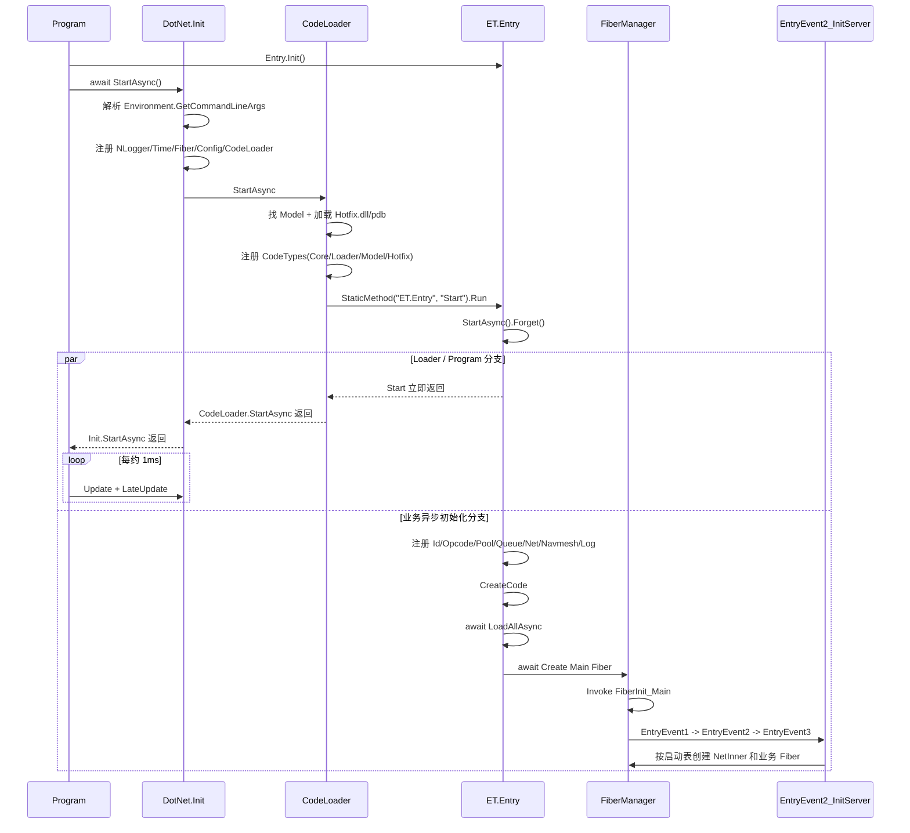
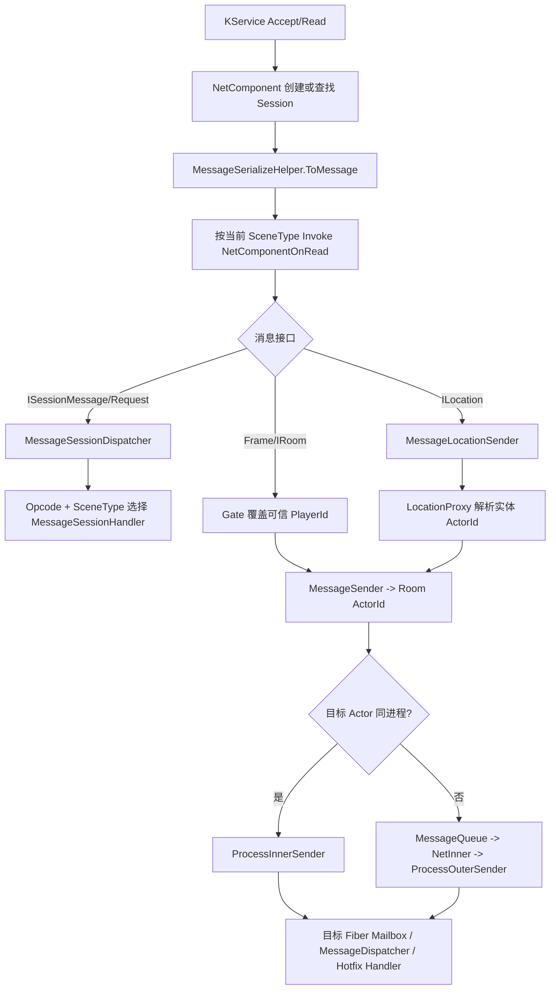

# 模块 30：ET 服务端运行链路

> Catalog ID: `SERVER-04`、`SERVER-05`
> 状态：`verified`  
> 最后核验：`2026-08-04`  
> 适用模式：ET Server / Admin / Agent / Shared

## 模块定位

本文描述独立 .NET ET 服务端从进程入口、命令行、日志、程序集与配置加载，到 Main/NetInner/业务 Fiber，再到网络消息、Session Handler、Actor/Location 路由和 Hotfix Handler 的完整运行链。`SERVER-04` 负责进程与 Fiber 启动；`SERVER-05` 负责消息接入、分派、路由和热重载。

本文不把 Demo、LockStep、Admin 的全部业务 API 复制一遍，而是说明这些模块如何接到共同运行时。具体协议、登录进图、锁步和运维功能继续查 [KnowledgeBase/18-Proto协议生成.md](18-Proto协议生成.md)、[KnowledgeBase/25-ET网络与锁步.md](25-ET网络与锁步.md) 和 [KnowledgeBase/26-管理后台与动态扩容.md](26-管理后台与动态扩容.md)。

## 源码边界

| 类型 | 仓库相对路径 | 说明 |
| --- | --- | --- |
| 进程入口 | `DotNet/App/Program.cs` | `Entry.Init`、Loader 启动与永久 update loop |
| 稳定 Loader | `DotNet/Loader/Init.cs`、`DotNet/Loader/CodeLoader.cs`、`DotNet/Loader/ConfigReader.cs` | Options、日志、时间、配置、Model/Hotfix 和 reload |
| 稳定项目 | `DotNet/Core`、`DotNet/Model`、`DotNet/Loader` | Core 运行时、实体/协议定义与不可热更加载边界 |
| 热更项目 | `DotNet/Hotfix` | 链接服务器/共享 Hotfix 源码，产出 `Hotfix.dll/.pdb` |
| 共享业务入口 | `Unity/Assets/Scripts/Game/ET/Code/Model/Share/Entry.cs` | 业务 Singleton、CodeTypes、配置和 Main Fiber |
| Main Fiber | `Unity/Assets/Scripts/Game/ET/Code/Hotfix/Share/FiberInit_Main.cs` | EntryEvent1/2/3 顺序 |
| 服务拓扑 | `Unity/Assets/Scripts/Game/ET/Code/Hotfix/Server/Demo/EntryEvent2_InitServer.cs` | 按 AppType 和启动表创建 NetInner/业务 Fiber |
| Fiber 初始化 | `Unity/Assets/Scripts/Game/ET/Code/Hotfix/Server/Module/NetInner`、`Unity/Assets/Scripts/Game/ET/Code/Hotfix/Server/Demo/Realm`、`Unity/Assets/Scripts/Game/ET/Code/Hotfix/Server/Demo/Gate`、`Unity/Assets/Scripts/Game/ET/Code/Hotfix/Server/Module/ActorLocation`、`Unity/Assets/Scripts/Game/ET/Code/Hotfix/Server/LockStep/Room`、`DotNet/Hotfix/Server/Admin`、`DotNet/Hotfix/Server/Agent` | SceneType 到组件集合的映射 |
| 网络接入 | `Unity/Assets/Scripts/Game/ET/Code/Hotfix/Share/Module/Message/NetComponentSystem.cs` | KService、Session、反序列化和 SceneType Invoker |
| Session 分派 | `Unity/Assets/Scripts/Game/ET/Code/Model/Share/Module/Message/MessageSessionDispatcher.cs` | Opcode + SceneType + 特性注册 |
| Gate/Realm 分支 | `Unity/Assets/Scripts/Game/ET/Code/Hotfix/Server/Demo/Gate/NetComponentOnReadInvoker_Gate.cs`、`Unity/Assets/Scripts/Game/ET/Code/Hotfix/Server/Demo/Realm/NetComponentOnReadInvoker_Realm.cs` | Session、Room、Actor、Location 路由 |
| 登录与 Gate Key | `Unity/Assets/Scripts/Game/ET/Code/Hotfix/Server/Demo/Gate/R2G_GetLoginKeyHandler.cs`、`Unity/Assets/Scripts/Game/ET/Code/Hotfix/Server/Demo/Gate/GateSessionKeyComponentSystem.cs`、`Unity/Assets/Scripts/Game/ET/Code/Hotfix/Server/Demo/Gate/C2G_LoginGateHandler.cs` | Gate Key 生成、20 秒超时删除、登录绑定与重连分支 |
| Actor/Location | `Unity/Assets/Scripts/Game/ET/Code/Hotfix/Server/Module/Message/MessageSenderSystem.cs`、`Unity/Assets/Scripts/Game/ET/Code/Hotfix/Server/Module/ActorLocation` | 同/跨进程 Actor RPC 与实体位置解析 |
| NetInner 转发 | `Unity/Assets/Scripts/Game/ET/Code/Hotfix/Server/Module/Message/A2NetInner_MessageHandler.cs`、`Unity/Assets/Scripts/Game/ET/Code/Hotfix/Server/Module/Message/A2NetInner_RequestHandler.cs`、`Unity/Assets/Scripts/Game/ET/Code/Hotfix/Server/Module/Message/ProcessOuterSenderSystem.cs` | 跨进程单向消息、RPC 请求和目标进程发送队列 |
| 协议源 | `Design/Proto/ET-Client`、`Design/Proto/ET-ClientServer` | 外网/内网消息权威源；生成到 Model/Generate，禁止手改 |

## 依赖关系

```text
App.dll
  -> Core.dll + Loader.dll + Model.dll
  -> ./Hotfix.dll + ./Hotfix.pdb (collectible AssemblyLoadContext)
  -> ET.Entry
  -> Config/Luban
  -> Main Fiber
     -> NetInner Fiber（进程端口非 0）
     -> DTStartSceneConfig 中属于当前 Process 的业务 Fibers
```

- `DotNet.App` 只负责进程循环；Loader 负责不可热更的服务装配；Model 持有实体和协议契约；Hotfix 持有 Handler、FiberInit 和业务 System。
- `CodeLoader` 从当前 AppDomain 按程序集名 `Model` 取稳定模型程序集，从进程工作目录读取 `./Hotfix.dll` 和 PDB；因此脚本必须先 `cd` 到 `Bin`。
- ConfigReader 从 `../Config/Luban/{file}.bytes|json` 读取配置，同样依赖 `Bin` 工作目录。
- `EntryEvent2_InitServer` 只为 `AppType.Server/Admin/Agent` 创建服务 Fiber；NetInner 还要求当前 `DTStartProcessConfig.Port != 0`，随后才遍历 `DTStartSceneConfig.GetByProcess(process)` 创建业务 Fiber。Watcher 走 WatcherComponent，GameTool 不创建业务 Fiber。`Console=1` 时 Main root 追加 ConsoleComponent。
- 业务 SceneType 选择对应 `[Invoke((long)SceneType.X)]` FiberInit。Scene/Fiber 的实际集合来自 Luban 启动表，不由目录名自动发现。

## 入口与调用链

### 进程启动链



准确顺序：

1. `Program.Main` 调 `RunAsync().Forget()`；`RunAsync` 先执行当前为空的 `Entry.Init`，再 await `DotNet.Init.StartAsync`，随后进入 `Thread.Sleep(1)` 的永久循环。
2. `Init.StartAsync` 解析真实进程参数，把 `Options` 注册到 World；随后创建带 AppType/Process 的 NLogger、TimeInfo、FiberManager、ConfigComponent 和 CodeLoaderComponent。
3. `CodeLoader` 找到 Model，使用可回收 `AssemblyLoadContext("Hotfix", true)` 加载当前目录 Hotfix DLL/PDB，注册四程序集 CodeTypes，再反射 `ET.Entry.Start`。
4. `ET.Entry.Start` 只调用 `StartAsync().Forget()`，不会把业务启动 UniTask 返回给 Loader；`CodeLoader.StartAsync` 因而只能确认反射入口已触发，不能确认配置与 Fiber 已经全部就绪。
5. `Entry.StartAsync` 在 fire-and-forget 分支中注册核心业务 Singleton，`CodeTypes.CreateCode` 扫描热代码，await 全部配置，最后创建固定 ID 的 Main Fiber。
6. `Program.RunAsync` 在 `Init.StartAsync` 返回后进入永久 update loop；由于 `Entry.StartAsync().Forget()` 与 Program loop 已经分叉，服务就绪必须观察配置加载、Main Fiber 和后续 NetInner/业务 Fiber 初始化，而不是只把 Loader 返回当作 ready。
7. `FiberManager.Create` 把初始化投递到目标 Fiber 的 SynchronizationContext，并按 SceneType 调 FiberInit；Main Fiber 的 FiberInit 按顺序发布 EntryEvent1/2/3。
8. EntryEvent1 给 Main root 添加 Timer、CoroutineLock、ObjectWait、Mailbox、ProcessInnerSender 与 DynamicEvent。EntryEvent2 在 `DTStartProcessConfig.Port != 0` 时创建 NetInner，并按启动配置创建当前 Process 的业务 Scene Fiber。

### Fiber 与网络就绪

| SceneType 示例 | FiberInit 添加的关键组件 | 输入来源 |
| --- | --- | --- |
| `NetInner` | Mailbox、Timer、CoroutineLock、ProcessOuterSender、ProcessInnerSender | `DTStartProcessConfig.IPEndPoint` |
| `Realm` | Mailbox、Timer、CoroutineLock、ProcessInnerSender、MessageSender、UDP NetComponent | `DTStartSceneConfig.InnerIPPort` |
| `Gate` | Realm 基础 + Player、GateSessionKey、LocationProxy、MessageLocationSender、UDP NetComponent | 启动表 Scene 配置 |
| `Location` | Mailbox、Timer、CoroutineLock、ProcessInnerSender、MessageSender、LocationManager | 启动表 Scene 配置 |
| `Admin` | ActorRpcBridge、AdminComponent 与 ASP.NET 管理服务 | Admin AppType/Fiber |
| `Agent` | AgentProcess、Heartbeat，并按机器与启动表拉起其他 Server 进程 | Agent AppType/Fiber |

只有 `FiberManager.Create` 成功返回后，调用方才能认为该 Fiber 的组件初始化完成。当前实现若 FiberInit 抛异常，只记录 `init fiber fail`，没有完成 `TaskCompletionSource`；等待创建的上游可能永久挂起，这是扩展 FiberInit 时必须重点验证的失败边界。

### 外网请求与 Handler 链



1. `NetComponent.Awake` 构造 `KService(..., ServiceType.Outer)` 并注册 Accept/Read/Error 回调；Update 每帧驱动 AService，Destroy 释放。
2. Accept 创建 Session，非 Benchmark 服务添加认证超时和空闲检查；Read 更新收包时间，反序列化消息、回收 buffer、记录 LogMsg，再按当前 SceneType Invoke。
3. Realm Invoker 只接受 Session 消息。Gate Invoker 同时处理 Session、Room、Frame 和 Location；Room/Frame 的 PlayerId 由已认证 Session 覆盖，不信任客户端输入。
4. `MessageSessionDispatcher.Awake` 从 CodeTypes 扫描 `[MessageSessionHandler]`，按 Opcode 保存多个 SceneType handler；Handle 只调用与 Session SceneType flag 匹配的实现。
5. `MessageSender` 同进程直接用 ProcessInnerSender；跨进程把 ActorId/消息包装后发到本进程固定 NetInner Fiber，再由内网服务转发。
6. `MessageLocationSender` 以 entityId 串行加锁，通过 LocationProxy 查 ActorId；NotFound 可清缓存重试，RPC timeout 与业务错误按 ErrorCore 转成异常或响应。

### Demo 真实业务调用

```text
C2R_Login (Realm Session Handler)
  -> 启动表按账号选择 Gate
  -> MessageSender.Call(Gate ActorId, R2G_GetLoginKey)
  -> 返回 Gate 地址/Key/GateId
  -> 1 秒后关闭 Realm Session

C2G_LoginGate (Gate Session Handler)
  -> 校验 20 秒有效 Gate Key（Get 只读字典，不消费 Key）
  -> 成功后移除 SessionAcceptTimeout；当前源码没有登录成功后 Remove Key
  -> 新 Player：创建 Player、Mailbox、Location，并绑定 SessionPlayer/PlayerSession
  -> 已有 Player 且在 Room：走 Room 重连，回包后绑定 SessionPlayer 并更新 PlayerSession
  -> 已有 Player、PlayerRoomComponent 已存在且 RoomActorId 为空：只更新 PlayerSessionComponent.Session
  -> 返回 PlayerId
```

后续 `C2G_EnterMap` 在 Gate 为 Player 创建临时 GateMap/Unit，查询 `Map1` 的启动配置，并把跨 Scene Transfer 延迟到本帧末尾。完整登录、传送和锁步链见 [KnowledgeBase/25-ET网络与锁步.md](25-ET网络与锁步.md)。

这里的“已有 Player 且非 Room”不是对任意已有 Player 都安全的通用分支。Handler 先 `GetComponent<PlayerRoomComponent>()`，随后无空值检查地读取 `RoomActorId`；只有该组件已经存在且 ActorId 为默认值时，才会进入只更新 PlayerSession 的分支。已有 Player 若没有该组件，当前实现可能在此前直接异常。

### Hotfix 与配置重载

- Console 的 `ReloadDllConsoleHandler` 调 `CodeLoaderComponent.ReloadAsync`。
- Admin 的 `Admin2S_ReloadHandler` 支持 `config`、`code`、`all`，分别调用 Config reload 和 CodeLoader reload，并把失败写入响应。
- Code reload 会卸载旧 collectible AssemblyLoadContext，强制 GC，重新读取 Hotfix DLL/PDB，替换 CodeTypes 并 `CreateCode`；Model/Core/Loader 不被替换。
- Model 契约、字段布局或生成消息变化必须重新编译/重启两端；不能只 reload Hotfix。

## 核心类型与 API

| 类型/API | 职责 | 生命周期/线程约束 |
| --- | --- | --- |
| `Program.RunAsync` | Loader 启动与进程主循环 | 永久循环；当前没有优雅退出/World.Dispose 路径 |
| `DotNet.Init` | Options、日志、时间、配置、CodeLoader 装配 | 启动异常被 catch 后调用 `Log.Error`；若异常发生在 Logger 注册前，catch 内也可能再次抛出 |
| `CodeLoader` | Model 定位、Hotfix AssemblyLoadContext、CodeTypes 与 reload | 文件路径相对 `Bin`；只热替换 Hotfix |
| `ConfigReader` | 从 `../Config/Luban` 读取 bytes/json | 同步文件 I/O 包装为已完成 UniTask；运行期 reload 仍会阻塞当前调用线程读取 |
| `ET.Entry` | 业务 Singleton、配置和 Main Fiber | Model 中稳定入口，逻辑初始化由热代码特性扫描完成 |
| `FiberManager.Create` | 创建 Fiber、加入 Scheduler、按 SceneType Invoke FiberInit | await 返回前应完成初始化；异常路径当前可能不完成等待源 |
| `FiberInit_*` | 给某 SceneType 组装组件 | 在目标 Fiber SynchronizationContext 执行 |
| `NetComponent` | Outer KService、Session 子实体与 SceneType 上抛 | 所属 Fiber Update 驱动；不能跨 Fiber 直接访问 Session |
| `MessageSessionDispatcher` | Opcode/SceneType 到 Session Handler | `[Code]` Singleton，reload 后重新扫描 |
| `MessageSender` | 同/跨进程 Actor Send/Call | 目标用 ActorId；跨进程固定经过 NetInner |
| `MessageLocationSenderComponent` | entityId 到 ActorId 的 Location 路由、缓存、串行与重试 | 按 LocationType 分组；迁移期间必须处理实例变化 |
| `MessageHandler` / `MessageSessionHandler` | Actor/Session 热更业务处理 | Handler 由特性、消息类型与 SceneType 选择 |

## 数据与生命周期

- World 持有 Options、Logger、TimeInfo、FiberManager、Config、CodeLoader 和业务 Singleton；当前服务端进程没有显式正常关闭路径，通常依赖进程终止。
- Model 与配置定义长期稳定；Hotfix 可重载。CodeTypes 重建会重新扫描 `[Code]` Singleton、事件、System 和 Handler，但已经存在的 Entity/组件布局不会自动迁移。
- Main Fiber 固定存在；NetInner/业务 Fiber 来自启动表；锁步 RoomRoot 等 Fiber 可运行期动态创建。Fiber 所有状态必须留在本 Fiber，通过消息跨边界。
- Scene root 持有 Timer、Mailbox、Sender、NetComponent 和业务组件；Session 是 NetComponent 子实体。连接错误或超时会 Dispose Session，并结束待决 RPC。
- Session 消息直接在连接所属 Scene 处理；Actor/Location 消息进入目标 Entity/Fiber。两套 Handler 不能混用。
- 跨进程 ActorId 包含 Process/Fiber/Instance 语义；Location 允许实体迁移后重新定位。缓存 ActorId 失效时必须走 Location 错误与重试逻辑。
- 协议源在 `Design/Proto`，生成消息在 Model/Generate；客户端/服务端必须使用同一代 Opcode 和消息布局。

## 开发扩展步骤

### 新增服务 Scene/Fiber

1. 在 Luban 启动表增加 StartProcess/StartScene，明确 Process、Zone、SceneType、名称和监听地址；先确认 AppType 会执行 Server 初始化分支。
2. 在 Model 定义该 Scene 所需组件；在 Hotfix 新建 `[Invoke((long)SceneType.X)]` FiberInit。
3. FiberInit 只组装当前 Scene 的 Timer/Mailbox/Sender/Net/业务组件；每个 await 都必须能失败完成，避免 `FiberManager.Create` 永久等待。
4. 外网 Scene 添加 NetComponent 并选择协议；内网 Actor 通信添加 ProcessInnerSender/MessageSender；需要迁移实体时添加 Location 组件。
5. 导表、编译 Model/Hotfix，从 `Bin` 启动目标 Process，核验 Fiber 数、端口、SceneType 和销毁/重启策略。

### 新增 Session RPC

1. 在 `Design/Proto/ET-Client` 修改协议，设置正确 ResponseType 和 Session 接口；运行 Proto 生成，禁止手改 Model/Generate。
2. 在 Server Hotfix 新增 `[MessageSessionHandler(SceneType.X)]` Handler；SceneType 必须与连接所在 NetComponent 一致。
3. 鉴权请求先校验输入、Key、范围和 Session 状态，成功后才移除认证超时；不能信任客户端 PlayerId。
4. Handler 异常转为明确 Error/Message；异步返回前确认 Session InstanceId 仍有效。
5. 运行成功、非法输入、超时、断线、重复请求和旧协议客户端验证。

### 新增 Actor/Location Handler

1. Actor 数据放 Model，行为放 Hotfix；消息实现 Actor/Location 接口并由 Proto 生成稳定字段。
2. 使用 `[MessageHandler(SceneType.X)]` 绑定目标 Entity/Scene；不要写成 Session Handler。
3. 同/跨进程统一调用 MessageSender；实体可迁移时从 MessageLocationSender 按 entityId 调用，不长期缓存实体对象。
4. 处理 NotFound、timeout、Location 迁移和 RpcId；目标 Fiber 内用 Mailbox/CoroutineLock 保证需要的顺序。
5. 在至少两个 Process 的真实配置下验证跨进程路径，单进程成功不能证明 NetInner 正常。

### Hotfix/运维扩展

1. 只改 Hotfix System/Handler 时可 reload；改 Model、Proto、Core、Loader、Options 或启动结构时完整重启。
2. Admin 新操作通过 ActorRpcBridge/MessageSender 进入目标 Fiber，不从 ASP.NET 线程直接操作 Entity。
3. Reload 前生成并原子替换完整 DLL/PDB；失败保留旧服务能力或返回明确错误，避免半更新。
4. 记录 revision、Process、StartConfig、请求类型、结果和日志，不能只以 HTTP 200 判断内部 Actor 操作成功。

## 约束与常见错误

- 从仓库根运行 `dotnet App.dll`：Loader 读取 `./Hotfix.dll`，ConfigReader 读取 `../Config/Luban`，工作目录错误会直接破坏启动。
- `Init.StartAsync` catch 启动异常后调用 `Log.Error`；如果异常早于 `World.Instance.AddSingleton<Logger, ILog>(log)`，catch 里的日志调用本身可能再次抛出。如果异常发生在 Logger 注册后并被记录，Program 仍可能进入永久循环；此时 TimeInfo/FiberManager 可能未完整注册，循环会持续报错。运维不能只看进程存活判断服务就绪。
- `ET.Entry.Start` 使用 `StartAsync().Forget()`，与 `Program.RunAsync` 的永久 update loop 分叉；不要把 `Init.StartAsync` 返回误判为业务 `Entry.StartAsync`、配置加载和 Fiber 拓扑全部完成。
- FiberInit 抛异常时只记录日志，当前 `TaskCompletionSource` 没有 SetException/SetResult，创建方可能永远 await。新 FiberInit 必须做故障注入验证。
- 没找到 Model/Hotfix 文件时没有统一前置完整性检查；反射入口和 CodeTypes 后续会失败。
- `AppType.Server/Admin/Agent` 只是进入服务创建分支；当前 `DTStartProcessConfig.Port == 0` 时不会创建 NetInner Fiber，跨进程 Actor RPC 也就不能用这个进程证明内网转发链路。
- 把目录下存在某个 FiberInit 写成该服务一定运行；实际选择由 AppType、StartConfig、Process 和 `DTStartSceneConfig` 决定。
- 把可能的 Handler 当成唯一目标；Session Dispatcher 允许同 Opcode 注册多个 SceneType handler，并在运行时按 flags 过滤。
- 混用 Session 与 Actor Handler，或跨 Fiber 持有 Session/Entity 引用。
- Gate 转发 Room/Location 消息时信任客户端 PlayerId；源码明确以 Session 绑定身份覆盖。
- Gate Key 不是当前实现下的强一次性票据：`GateSessionKeyComponent.Get` 只 `TryGetValue`，20 秒超时协程才删除，`C2G_LoginGateHandler` 成功分支也没有 Remove。需要 one-shot 语义时必须补成功消费和重复登录验证。
- 已有 Player 的登录分支先无空值检查地读取 `PlayerRoomComponent.RoomActorId`；组件缺失时可能直接异常。仅当组件存在且 ActorId 为空时才只更新 `PlayerSessionComponent.Session`，且没有重新给新 Session 添加 `SessionPlayerComponent`；后续依赖 SessionPlayer 的 Gate 消息必须按这两个边界核验。
- 只在同 Process 测 Actor RPC，遗漏跨 Process NetInner、端口、防火墙和协议问题。
- reload Model/Proto 变化，只替换 Hotfix；已存在 Entity 和两端消息布局不会自动迁移。
- 用进程被强制关闭代替优雅 shutdown 测试；当前 Program 没有取消令牌、信号处理和 World.Dispose 链。

## 验证方法

### 建议步骤

```powershell
# 编译
dotnet build DotNet/DotNet.sln

# 从 Bin 启动默认 Server
Set-Location Bin
dotnet App.dll --Process=1 --StartConfig=Localhost --Console=1

# 独立 Admin / Agent 入口
dotnet App.dll --AppType=Admin --Process=100002 --StartConfig=Localhost --Console=1
dotnet App.dll --AppType=Agent --Process=100001 --StartConfig=Localhost --Console=1
```

运行时至少核验：

1. Options、NLogger、Config、CodeTypes、Main/NetInner/业务 Fiber 的启动顺序与数量。
2. Realm/Gate 端口监听、非法连接认证超时、C2R/C2G 登录与 Session 生命周期。
3. 同进程和跨进程 Actor RPC、Location 迁移/NotFound/timeout。
4. config/code/all reload 的成功与失败路径，以及旧 Entity/协议的兼容边界。
5. 缺 Hotfix、缺 Config、错误参数、FiberInit 抛异常时进程健康检查能识别未就绪，而不是只看 PID。

### 本轮实际执行结果

- 已使用 codedb 图和 `codedb_read` 精确范围核验 `DotNet/App/Program.cs`、`DotNet/Loader/Init.cs` 的启动分叉与异常边界，并按精确源码行号复核 `DotNet/Loader/CodeLoader.cs`、`Unity/Assets/Scripts/Game/ET/Code/Model/Share/Entry.cs`、Main/NetInner/Gate Fiber、网络读取、Session/Actor/Location 分派和 reload 入口。
- 已核验 `Unity/Assets/Scripts/Game/ET/Code/Hotfix/Server/Demo/Realm/C2R_LoginHandler.cs`、`Unity/Assets/Scripts/Game/ET/Code/Hotfix/Server/Demo/Gate/R2G_GetLoginKeyHandler.cs`、`Unity/Assets/Scripts/Game/ET/Code/Hotfix/Server/Demo/Gate/C2G_LoginGateHandler.cs`、`Unity/Assets/Scripts/Game/ET/Code/Hotfix/Server/Demo/Gate/C2G_EnterMapHandler.cs` 的真实调用和身份边界。
- 本轮没有执行 `dotnet build`、没有启动服务端/Admin/Agent、没有连接端口或触发 reload；`KnowledgeBase/runtime-acceptance.json` 的 server-start 仍为 `not_run`。

## 源码证据

- `DotNet/App/Program.cs:9`、`DotNet/Loader/Init.cs:9`：`RunAsync().Forget()`、进程 loop、Options/服务装配及 Logger 注册前异常边界。
- `DotNet/Loader/CodeLoader.cs:15`、`DotNet/Loader/ConfigReader.cs:8`：Model/Hotfix、AssemblyLoadContext、工作目录和配置读取。
- `Unity/Assets/Scripts/Game/ET/Code/Model/Share/Entry.cs:24`、`Unity/Assets/Scripts/Game/ET/Code/Model/Share/Entry.cs:29`、`Unity/Assets/Scripts/Game/ET/Code/Hotfix/Share/FiberInit_Main.cs:8`：`Entry.StartAsync().Forget()`、业务 Singleton、配置、Main Fiber 与三阶段事件。
- `Unity/Assets/Scripts/Game/ET/Code/Hotfix/Server/Demo/EntryEvent2_InitServer.cs:8`、`Unity/Assets/Scripts/Game/ET/Code/Hotfix/Server/Demo/EntryEvent2_InitServer.cs:18`：AppType、`Port != 0` 的 NetInner 条件和启动表 Scene Fiber 创建。
- `Unity/Assets/Scripts/Library/ET/Core/Runtime/World/Module/Fiber/FiberManager.cs:65`：Fiber 初始化投递、等待与异常未完成风险。
- `Unity/Assets/Scripts/Game/ET/Code/Hotfix/Server/Module/NetInner/FiberInit_NetInner.cs:9`、`Unity/Assets/Scripts/Game/ET/Code/Hotfix/Server/Demo/Gate/FiberInit_Gate.cs:9`：内网和 Gate 组件装配。
- `Unity/Assets/Scripts/Game/ET/Code/Hotfix/Share/Module/Message/NetComponentSystem.cs:10`：KService、Session、反序列化和 SceneType Invoker。
- `Unity/Assets/Scripts/Game/ET/Code/Model/Share/Module/Message/MessageSessionDispatcher.cs:23`：特性扫描、Opcode 和 SceneType 过滤。
- `Unity/Assets/Scripts/Game/ET/Code/Hotfix/Server/Demo/Gate/NetComponentOnReadInvoker_Gate.cs:14`：Session/Room/Location 分支和可信身份覆盖。
- `Unity/Assets/Scripts/Game/ET/Code/Hotfix/Server/Module/Message/MessageSenderSystem.cs:9`、`Unity/Assets/Scripts/Game/ET/Code/Hotfix/Server/Module/Message/A2NetInner_MessageHandler.cs:5`、`Unity/Assets/Scripts/Game/ET/Code/Hotfix/Server/Module/Message/A2NetInner_RequestHandler.cs:5`、`Unity/Assets/Scripts/Game/ET/Code/Hotfix/Server/Module/Message/ProcessOuterSenderSystem.cs:8`、`Unity/Assets/Scripts/Game/ET/Code/Hotfix/Server/Module/ActorLocation/MessageLocationSenderComponentSystem.cs:93`：同/跨进程 Actor、NetInner 转发和 Location 路由。
- `Unity/Assets/Scripts/Game/ET/Code/Hotfix/Server/Demo/Realm/C2R_LoginHandler.cs:5`、`Unity/Assets/Scripts/Game/ET/Code/Hotfix/Server/Demo/Gate/R2G_GetLoginKeyHandler.cs:5`、`Unity/Assets/Scripts/Game/ET/Code/Hotfix/Server/Demo/Gate/GateSessionKeyComponentSystem.cs:8`、`Unity/Assets/Scripts/Game/ET/Code/Hotfix/Server/Demo/Gate/C2G_LoginGateHandler.cs:8`：真实登录、20 秒 Gate Key、读取不消费、Player/Room 重连与 Session 绑定。
- `Unity/Assets/Scripts/Game/ET/Code/Hotfix/Server/Demo/Gate/C2G_EnterMapHandler.cs:5`：Gate 临时 Map/Unit、`Map1` 启动配置和 `TransferAtFrameFinish`。
- `DotNet/Hotfix/Server/Admin/Admin2S_ReloadHandler.cs:6`、`DotNet/Hotfix/Server/Admin/FiberInit_Admin.cs:6`、`DotNet/Hotfix/Server/Agent/FiberInit_Agent.cs:7`：管理重载、Actor bridge 和 Agent 进程编排。

## 关联知识

- 上游：`SERVER-01`～`SERVER-03` [.NET 服务端与拓扑](21-DotNet服务端.md)，`ET-01`～`ET-03` [Core/Loader/四程序集](15-ET模块.md)。
- 下游：`ET-07` [网络、Demo 与 LockStep](25-ET网络与锁步.md)，`OPS-01` [Admin/Agent 与动态扩容](26-管理后台与动态扩容.md)。
- 数据：`DATA-01` [Luban 启动配置](17-Luban配置表.md)，`DATA-02` [Proto 协议生成](18-Proto协议生成.md)。
- 规范：`CODE-02`、`CODE-03` [ET System、消息、构建与发布脚本规则](31-脚本编写规范.md)。
