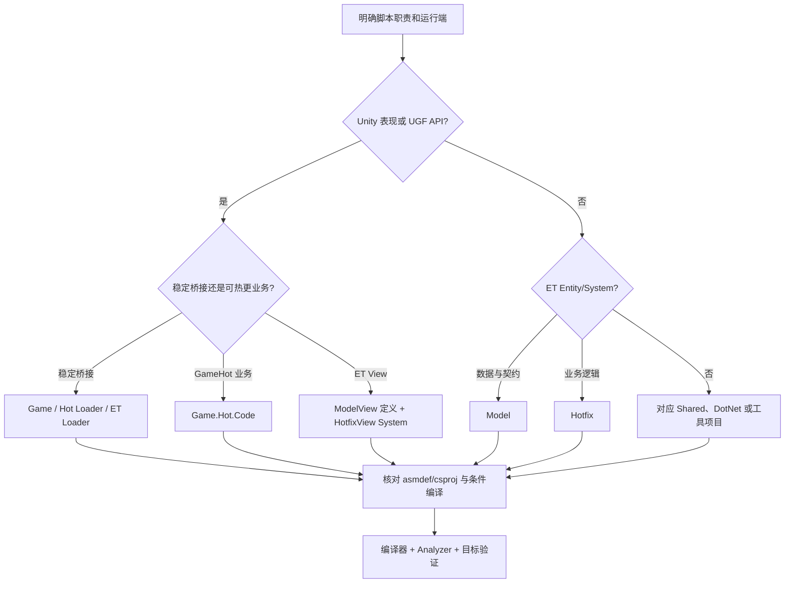

# 模块 31：脚本编写规范

> Catalog ID: `CODE-01`、`CODE-02`、`CODE-03`  
> 状态：`verified`  
> 最后核验：`2026-08-05`  
> 适用模式：GameHot / ET Client / ET Server / Shared / Editor / Automation

## 模块定位

本文定义本仓库新增和修改脚本时的共同约束，覆盖 Unity/GameHot 运行时代码、ET Entity/System、Editor、测试、Analyzer/SourceGenerator、PowerShell、BAT、Luban、Proto、构建与发布脚本。它回答“代码应放在哪里、由谁驱动、哪些规则会阻断编译、提交前如何证明修改有效”，不重复各业务模块的完整 API 清单。

规则按权威性分四级：

| 等级 | 含义 | 冲突处理 |
| --- | --- | --- |
| A：工具强制 | 编译器、asmdef/csproj、Analyzer、SourceGenerator、条件编译或验证脚本实际执行 | 必须遵守；先修实现，不能用文档绕过 |
| B：仓库模式 | 当前源码中稳定出现的目录、生命周期、所有权和调用方式 | 新代码默认跟随；偏离时要有可验证理由 |
| C：书面约定 | `AGENTS.md`、`Book/`、KnowledgeBase 与仓库内流程文档 | 与 A/B 冲突时以当前编译边界和源码为准并修正文档 |
| D：团队建议 | CCGS standards、可读性、性能和测试建议 | 只在适配本仓库后采用，不视为已有自动门禁 |

## 源码边界

| 类型 | 仓库相对路径 | 说明 |
| --- | --- | --- |
| 仓库指令 | `AGENTS.md`、`KnowledgeBase/LOOP.md` | AI 工作顺序、模块核验与提交证据 |
| Unity 稳定层 | `Unity/Assets/Scripts/Game`、`Unity/Assets/Scripts/Game/Hot/Loader`、`Unity/Assets/Scripts/Game/ET/Loader` | 不随业务热更或承担桥接职责 |
| GameHot 业务层 | `Unity/Assets/Scripts/Game/Hot/Code` | `UNITY_GAMEHOT` 下业务逻辑；启用 HybridCLR 时作为热更程序集 |
| GameHot 纯 C# 验证层 | `Unity/Assets/Scripts/Game/Hot/Code/Buqi/Battle`、`Share/Buqi.Simulation.Headless` | Buqi 战斗内核可被 .NET 8 headless 项目直接链接；不得引入 Unity/UGF/ET/资源/网络依赖 |
| ET 业务层 | `Unity/Assets/Scripts/Game/ET/Code/Model`、`Unity/Assets/Scripts/Game/ET/Code/Hotfix`、`Unity/Assets/Scripts/Game/ET/Code/ModelView`、`Unity/Assets/Scripts/Game/ET/Code/HotfixView` | 数据、逻辑、视图数据、视图逻辑四层边界 |
| Editor | `Unity/Assets/Scripts/Game/Editor`、`Unity/Assets/Scripts/Game/Hot/Code/Editor`、`Unity/Assets/Scripts/Game/ET/Code/Editor` | 只允许编辑器平台编译，不得进入 Player 运行时依赖链 |
| Analyzer | `Share/Analyzer` | ET 与仓库定制诊断；每条规则按自己的 AnalyzeAssembly 范围生效 |
| SourceGenerator | `Share/SourceGenerator` | 生成 ET System、Reactive、序列化等编译输入，并独立报告生成器诊断；GetComponent 遗留生成器当前停用 |
| .NET 接入 | `DotNet/App/DotNet.App.csproj`、`DotNet/Core/DotNet.Core.csproj`、`DotNet/Loader/DotNet.Loader.csproj`、`DotNet/Model/DotNet.Model.csproj`、`DotNet/Hotfix/DotNet.Hotfix.csproj`、`DotNet/ThirdParty/DotNet.ThirdParty.csproj`、`DotNet/Directory.Build.props` | 目录默认 C# 11；当前六个项目均显式覆盖为 C# 12，项目级配置优先 |
| Unity 接入 | `Unity/Directory.Build.props`、`Unity/Assets/Plugins/Share.Analyzer.dll.meta`、`Unity/Assets/Plugins/Share.SourceGenerator.dll.meta` | Unity 使用预编译 Roslyn Analyzer；SourceGenerator 受 `UNITY_ET` 约束 |
| 数据与协议源 | `Design/Excel`、`Design/Proto` | Luban/Proto 的可编辑输入；生成目标禁止手改 |
| 自动化 | `KnowledgeBase/Test-KnowledgeBase.ps1`、`plugins/ccgs-codex/scripts/sync-ccgs.ps1`、`Publish-linux-x64.ps1`、`Tools/Shell/build kit sln.bat`、`Tools/Shell/start et server.bat` | 验证、同步、发布和本地启动/清理脚本 |

## 依赖关系

### 程序集方向

```text
Game
  <- Game.Hot.Loader <- Game.Hot.Code
  <- Game.ET.Loader  <- Model <- Hotfix
                           <- ModelView <- HotfixView

Editor asmdef -> 对应 Runtime/业务 asmdef
Runtime/业务 asmdef -X-> Editor asmdef
```

- `Game.Hot.Code` 受 `UNITY_GAMEHOT` 和 `!UNITY_HOTFIX || UNITY_COMPILE || UNITY_EDITOR` 控制；Loader 只受 `UNITY_GAMEHOT` 控制。
- `Share/Buqi.Simulation.Headless` 通过 `<Compile Include="..\..\Unity\Assets\Scripts\Game\Hot\Code\Buqi\Battle\**\*.cs" />` 链接同一份 GameHot/Buqi/Battle 源码，并启用 `BUQI_HEADLESS`、C# 9 与 TreatWarningsAsErrors；该目录内的代码应保持纯 C#，不能反向依赖 Unity/UGF/ET。
- ET 四业务程序集均受 `UNITY_ET` 和热更条件控制；Model/Hotfix 的 `noEngineReferences=true`，Unity 表现代码必须进入 ModelView/HotfixView 或稳定 Loader 桥。
- `Share.Analyzer` 和 `Share.SourceGenerator` 在 DotNet Core/Loader/Model/Hotfix 中以 `OutputItemType="Analyzer"`、`ReferenceOutputAssembly="false"` 接入；它们是编译工具，不是运行时依赖。
- Unity 的 `Share.SourceGenerator.dll` 同时由 `Unity/Directory.Build.props` 和带 `RoslynAnalyzer` label 的 `.meta` 接入，并受 `UNITY_ET` define constraint 控制。源码项目构建后的 DLL 不会自动复制到 Unity Plugins，更新工具时必须显式同步和验证。

### 规则生效范围

| 工具 | 适用范围 | 诊断与严重度 |
| --- | --- | --- |
| ET Analyzer | `Share/Analyzer/Config/AnalyzeAssembly.cs` 定义 DotNet `Core`/`Model`/`Hotfix` 与 Unity `ET.Core`、`Game.ET.Code.Model`、`Game.ET.Code.Hotfix`、`Game.ET.Code.ModelView`、`Game.ET.Code.HotfixView`；各 Analyzer 在 `Share/Analyzer/Analyzer/*.cs` 中按 `All`、`AllModel`、`AllHotfix`、`AllModelHotfix`、`ServerModelHotfix` 等数组选择子集 | `Share/Analyzer/Config/DiagnosticRules.cs` 当前创建的 ET 诊断均为 `DiagnosticSeverity.Error`；范围外代码不会被这些 ET 规则自动阻断 |
| Custom Analyzer | `Share/Analyzer/Custom/Config/CustomAnalyzeAssembly.cs` 定义 `All`、`GameAll` 与 `GameRuntimeAll`；`CustomOnlyUniTaskAnalyzer` 用 `All`，`CustomDeclarationAnalyzer` 用 `GameAll`，`CustomLogMethodAnalyzer` 与 `CustomStringConcatAnalyzer` 用 `GameRuntimeAll` | `Share/Analyzer/Custom/Config/CustomDiagnosticRules.cs` 当前创建的定制诊断均为 `DiagnosticSeverity.Error`；不能把 `GameRuntimeAll` 的日志/字符串规则泛化到仓库全部 C# |
| SourceGenerator | 实际接入 `Share.SourceGenerator` 的 DotNet 项目和 Unity 程序集，接入点包括 `DotNet/*/*.csproj`、`Unity/Directory.Build.props` 与 `Unity/Assets/Plugins/Share.SourceGenerator.dll.meta` | `Share/SourceGenerator/Config/DiagnosticRules.cs` 独立报告 `ET1001`、`ET1101`～`ET1114`；`ET1114` 是 `DiagnosticSeverity.Warning`，其余当前为 `Error` |

`Share/Analyzer/AnalyzerGlobalSetting.cs` 中 `EnableAnalyzer` 当前为 `true`，但 `Model/Generate`、`Model/Client/Generate`、`Hotfix/Server/Admin`、`Hotfix/Server/Agent` 被显式忽略；因此“没有诊断”不等于该目录符合全部规则。

不能仅按 `Share/Analyzer/Analyzer/` 目录判断规则作用域。`AsyncMethodReturnTypeAnalyzer` 虽属于 ET Analyzer 目录，却显式使用 `CustomAnalyzeAssembly.All`；因此禁止 `async void` 的规则还会覆盖该集合中的 Game、Editor、GameHot 等程序集，而不只覆盖 `AnalyzeAssembly` 的 ET 程序集。

`Share/SourceGenerator/Generator/ETGetComponentGenerator.cs` 当前只是保留实现：`Initialize` 中的 `context.RegisterForSyntaxNotifications(SyntaxContextReceiver.Create)` 被注释，`Execute` 在没有 receiver 时直接返回，所以现状不会生成 `Get<Component>` 扩展。`DotNet/Directory.Build.props:3` 的目录默认语言版本是 `<LangVersion>11.0</LangVersion>`；`DotNet/App/DotNet.App.csproj:6`、`DotNet/Core/DotNet.Core.csproj:8`、`DotNet/Loader/DotNet.Loader.csproj:5`、`DotNet/Model/DotNet.Model.csproj:5`、`DotNet/Hotfix/DotNet.Hotfix.csproj:5`、`DotNet/ThirdParty/DotNet.ThirdParty.csproj:5` 六个项目均显式覆盖为 `<LangVersion>12</LangVersion>`。

## 入口与调用链

### 新脚本决策链



### 编译期规则链

```text
C# 源码
  -> asmdef / csproj 选择程序集、平台和 define
  -> Share.Analyzer 在对应范围报告当前 Error 级规则
  -> Share.SourceGenerator 扫描 ET 特性、报告生成器诊断并 AddSource 注入 .g.cs
  -> Unity 或 dotnet 编译
  -> 运行时/Editor/脚本验证
```

生成器输入是带特性的实体、组件和 System 声明；输出只属于编译上下文或中间目录。不要把 `.g.cs` 复制回业务目录，也不要在生成代码上修复设计错误。

## 核心类型与 API

| 类型/API | 职责 | 生命周期/线程约束 |
| --- | --- | --- |
| `DiagnosticRules` / `CustomDiagnosticRules` | 定义 ET 与仓库定制 Analyzer 诊断；当前为 `Error` | 仅在各 Analyzer 声明的范围内生效 |
| `ETTaskAnalyzer` | 要求 UniTask 调用在异步方法中 `await` 或 `.Forget()`，在同步方法中 `.Forget()` | 不能遗留未观察的 UniTask |
| `ETCancellationTokenAnalyzer` | 约束 token 默认值、空值、向下传递与 await 后取消检查 | 每个可取消异步边界都要显式传播语义 |
| `EntitySystemAnalyzer` | 校验 Entity 生命周期接口是否有对应 System，以及 System 特性所在类 | Entity 数据与行为分离 |
| `EntityMemberDeclarationAnalyzer` | 禁止 Entity 持有不安全实体引用/委托等成员并检查组件/子实体标记 | 使用 `EntityRef` 与特性表达所有权 |
| `CustomDeclarationAnalyzer` | 校验类型、方法、字段、属性和局部变量命名 | 具体诊断以编译输出为准，不自行猜例外 |
| `CustomLogMethodAnalyzer` | Unity 业务中禁止直接使用 `UnityEngine.Debug` | 使用 `UnityGameFramework.Runtime.Log`；ET Entity 上下文按规则使用 Fiber 日志 |
| `CustomStringConcatAnalyzer` | 禁止受分析代码使用 `+`、`string.Format`、`string.Concat` 组装字符串 | 使用 `GameFramework.Utility.Text.Format`；必要豁免使用仓库特性并说明原因 |
| `ETSystemGenerator` | 读取 EntitySystem 特性并生成 System 调用包装 | 生成结果随编译产生，不是手改源 |
| `ETGetComponentGenerator` | 保留的组件访问生成器实现；当前 receiver 注册被注释，`Execute` 会直接返回 | 当前不得依赖它生成 GetComponent 扩展；恢复注册后还需补生成器测试 |
| `StarForceUIForm` / `Entity` / `ProcedureBase` | GameHot UI、实体与流程生命周期入口 | 重资源操作放进入/退出节点，订阅与释放对称 |
| `EntitySystemOf` / `ComponentOf` / `ChildOf` | ET System、组件和子实体关系声明 | Model 定义，Hotfix/HotfixView 实现行为 |

## 数据与生命周期

### Unity 与 GameHot

- 稳定基础能力放 `Game` 或 Loader；需要 HybridCLR 更新的业务实现放 Code。Loader 可以被 Code 引用，不能反向依赖 Code。
- Procedure 在进入时取得本状态所需资源、事件和 UI，在离开时撤销订阅并释放状态所有权；跨状态长期状态应由明确的 Component/Container/配置持有。
- UIForm 只在生命周期回调中建立和释放按钮、事件、异步任务与子组件；重复 `OnOpen` 不得重复订阅，`OnClose`/`OnRecycle` 必须对称清理。
- Entity 的一次显示状态由 `OnShow` 输入数据初始化，在 `OnHide` 清理；缓存对象进入对象池后不能继续被异步回调、事件或外部强引用使用。
- 事件订阅、计时器、取消令牌和异步 continuation 都属于资源。创建它们的生命周期节点负责释放，不把清理责任留给调用者猜测。

### ET

- Model/ModelView 声明 Entity/Component 和持久状态；Hotfix/HotfixView 的静态 System 实现行为。不要给 Entity 塞入普通业务方法来绕开 System。
- Entity 不直接保存 Entity 字段或含 Entity 类型参数的泛型字段；跨生命周期引用使用 `EntityRef`，子实体/组件关系使用 `ChildOf`/`ComponentOf`。
- 组件创建、Awake、更新、销毁和序列化依赖 EntitySystem 与生成器。新增生命周期接口后必须让对应 `[EntitySystemOf]` 静态类提供被识别的方法。
- 客户端/服务端共享代码不能引用客户端命名空间；锁步 Entity 不声明浮点字段/属性；网络消息不携带 Entity 字段。
- Hotfix reload 只替换可重载逻辑程序集；Model 契约、字段布局和稳定 Loader 改动按重启/重构建处理。

### 自动化

- 数据源、生成配置、生成物和运行时读取端是一个变更单元。修改 Excel/Proto schema 时同步检查生成命令、输出目录、调用代码和兼容性。
- PowerShell/BAT 必须把路径、外部进程、生成目录和退出码作为显式状态；脚本执行失败时应立即停止，不能在错误后继续复制、删除或宣称成功。
- 构建、导表、协议生成、发布会改写大量文件。执行前记录 `git status`，执行后只审查预期生成范围。

## 开发扩展步骤

### 运行时 C#

1. 从 `KnowledgeBase/catalog.json` 定位所属模块，再确认目标 asmdef/csproj、运行端和热更边界。
2. 选择现有同类脚本作为模板：Procedure 对照 Procedure，UIForm 对照同模式 UIForm，Entity 对照同模式 Entity，ET System 对照同 SceneType/程序集的 System。
3. 先定义状态所有权、输入数据、取消/关闭行为和错误反馈，再写方法体。
4. 异步方法只使用 UniTask；调用点明确 `await` 或 `.Forget()`，可取消链传递同一个 token，并在 await 后按 Analyzer 要求检查取消。
5. 在创建订阅、计时器、Entity/UI、资源句柄的同一生命周期中写对称释放。
6. 编译目标程序集，处理全部 Analyzer error；再执行对应 UI、场景、网络或服务端验证。

### ET Entity/System

1. 在 Model 或 ModelView 声明 Entity/Component，添加准确的 `ComponentOf`/`ChildOf`、序列化与生命周期接口。
2. 在 Hotfix 或 HotfixView 创建 `[EntitySystemOf(typeof(...))]` 静态 partial System 类。
3. 为生命周期方法添加正确 System 特性；让 SourceGenerator 生成包装，不手写 `.g.cs`。
4. 状态通过 `self` 与组件持有；跨 Entity 使用 `EntityRef`，跨 Fiber/进程使用消息，不直接持有外部 Fiber 或 Entity 对象。
5. 新消息先修改 Proto 源并生成，再实现 handler；服务端验证消息注册、SceneType、Actor/Location 路由和错误响应。

### Editor 与测试

1. 任何引用 `UnityEditor` 的脚本放入 `Editor` 目录和 Editor-only asmdef；运行时程序集不得反向引用。
2. Editor 菜单或批处理先校验选择、路径、模式和输出边界，再调用 AssetDatabase/构建 API；异常必须使操作失败并留下明确日志。
3. 纯规则、状态机、配置转换优先写确定性单元测试；跨模块写集成测试；UI/VFX/输入手感使用真实 Editor/目标设备截图和操作证据。
4. 测试独立建立与清理状态，不依赖执行顺序、网络、数据库、系统时间或共享可变数据；Bug 修复应增加能复现原问题的回归测试。
5. 当前新增的 `Unity/Assets/Tests/GameHot/Buqi/EditMode` 与 `Share/Buqi.Simulation.Headless` 构成 Buqi 战斗内核的确定性验证入口，但尚未纳入知识库独立模块或本轮运行验收。新增正式测试时必须同时提交测试 asmdef/项目、执行命令和证据路径。

### PowerShell 与 BAT

PowerShell 新脚本采用下列最小骨架：

```powershell
[CmdletBinding()]
param([Parameter(Mandatory)][string]$Target)

$ErrorActionPreference = 'Stop'
$repoRoot = (Resolve-Path (Join-Path $PSScriptRoot '..')).Path
$targetPath = Join-Path $repoRoot $Target
if (-not (Test-Path -LiteralPath $targetPath)) {
    throw "Target does not exist: $targetPath"
}

& dotnet build (Join-Path $repoRoot 'Kit.sln')
if ($LASTEXITCODE -ne 0) {
    throw "dotnet build failed with exit code $LASTEXITCODE"
}
```

BAT 新脚本至少使用：

```bat
@echo off
setlocal
cd /d "%~dp0\..\.." || exit /b 1
dotnet build Kit.sln
if errorlevel 1 exit /b %errorlevel%
endlocal
```

路径始终加引号；以 `%~dp0` 锚定脚本目录；CI 脚本不使用 `pause`；删除/同步前检查解析后的源和目标。现有 `Tools/Shell` 清理与 ET/GDK 同步脚本含递归删除、硬编码相邻目录且缺少统一错误传播，只能在人工确认备份和 `git status` 后运行，不能作为新脚本模板。

### Luban、Proto、构建与发布

1. 先编译 `Kit.sln`/工具项目，确认 `Bin/Tool.exe` 可用。
2. Luban 先执行 Check，再执行目标格式导出；Proto 从 `Design/Proto/*/proto.conf` 与 `.proto` 生成。
3. 生成后只修改源配置解决问题；`Unity/Assets/**/Generate`、`DotNet/Model/Generate` 与 Luban/Proto 输出禁止手改。
4. 构建前完成模式、HybridCLR、资源规则与配置输出核对；发布脚本必须检查 `dotnet publish` 退出码再复制 Bin/Config。
5. 提交前运行目标编译、知识库门禁和本功能的运行/Editor 验证，并只暂存本任务文件。

## 约束与常见错误

### A 级：会被工具阻断或破坏编译边界

以下 Analyzer 规则只在 `AnalyzeAssembly` 或 `CustomAnalyzeAssembly` 为该规则声明的程序集范围内自动阻断；范围外仍应按 B/C 级仓库约定审查，不能伪称已有编译门禁。

- UniTask 调用既不 `await` 也不 `.Forget()`；声明 `async void`；混用 `Task` 与 UniTask。
- 可取消方法给 token 默认值、调用时传 `null`、await 时换 token、await 后不检查取消。
- Entity 多层继承、声明委托/Entity 字段/泛型 Entity、同时标为 Component 和 Child，或错误使用 `AddChild`/`AddComponent`。
- EntitySystem 特性放在没有 `[EntitySystemOf]` 的类中，或声明生命周期接口却没有可生成的 System 方法。
- Server 程序集引用 `ET.Client`；锁步 Entity 使用浮点状态；网络消息直接保存 Entity。
- Model/Hotfix 引用 UnityEngine，Runtime asmdef 引用 Editor asmdef，或绕开 define constraint 强行编译热更代码。
- 手改生成目录，导致下一次 Luban、Proto 或 SourceGenerator 覆盖修改。

### B/C 级：仓库生命周期和书面约定

- 在 Loader 反向引用热更 Code，或把可热更业务塞入稳定桥接层。
- 在 `OnOpen`/`OnShow` 重复订阅，在 `OnClose`/`OnHide` 不释放；对象池回收后异步回调继续写对象。
- 在 Entity/Fiber 语境使用错误日志入口；在 Unity 业务中直接 `UnityEngine.Debug`；吞掉异常后继续流程。
- 用硬编码路径、资源 ID、UI/Entity 配置替代 Luban 或生成 ID；修改配置却不重新导出和验证读取端。
- 把“源码可编译”写成“Unity/服务端/Player 已运行”，或为了门禁变绿伪造 `KnowledgeBase/runtime-acceptance.json`。

### D 级：采用前必须适配

- CCGS 的 `src/**`、Godot 命名、固定 `tests/unit` 目录、所有系统必须 DI/ADR 等规则不是本仓库现有编译约束。
- 可采用其确定性测试、UI 截图、数据驱动、服务端输入验证和提交证据原则，但目录、框架和门禁必须映射到 Unity、UGF、ET、Luban 与当前 CI。
- 性能规则必须先有 Profile 数据；不能把“零分配”“2ms 预算”等通用目标写成未经测量的既成事实。

## 验证方法

### 建议步骤

```powershell
# 解决方案与服务端编译
dotnet build Kit.sln
dotnet build DotNet/DotNet.sln

# 知识库普通/静态完整门禁
powershell -ExecutionPolicy Bypass -File KnowledgeBase/Test-KnowledgeBase.ps1
powershell -ExecutionPolicy Bypass -File KnowledgeBase/Test-KnowledgeBase.ps1 -RequireStaticComplete
```

Unity 代码还要在当前模式下等待 Editor 编译完成并检查 Console；UI/场景/Entity 使用真实 Play Mode 操作和截图；ET 网络/服务端修改运行目标进程并验证请求、错误和关闭；构建脚本在目标平台验证退出码和产物。

### 本轮实际执行结果

- 已静态核验 asmdef/csproj、Analyzer 诊断定义与分析范围、SourceGenerator 入口、PowerShell/BAT、CCGS compatibility 和 KnowledgeBase Loop。
- 本轮开始时普通知识库门禁在基线 `5846178ff913ebe3c36af53baf26d44663e644c9` 复现 9 个源码指纹漂移，涉及 GameHot active/toolchain 切换、Buqi headless 验证项目和 `DotNet.ThirdParty` PackageCache 编译边界；本轮已按源代码证据更新相关知识页后再刷新指纹。
- 本轮没有执行 Unity 编译、Play Mode、服务端启动、Luban、Proto 或 Player 构建；`KnowledgeBase/runtime-acceptance.json` 保持 `not_run`。

## 源码证据

- `Share/Analyzer/Config/DiagnosticRules.cs:5`、`Share/Analyzer/Custom/Config/CustomDiagnosticRules.cs:5`：ET 与仓库定制 Analyzer 的 Error 级规则定义。
- `Share/Analyzer/Config/AnalyzeAssembly.cs:3`、`Share/Analyzer/Custom/Config/CustomAnalyzeAssembly.cs:3`、`Share/Analyzer/AnalyzerGlobalSetting.cs:5`：ET/Custom 实际分析程序集和忽略目录；`Share/Analyzer/Analyzer/AsyncMethodReturnTypeAnalyzer.cs:26` 是 ET Analyzer 目录中改用 `CustomAnalyzeAssembly.All` 的跨范围例外。
- `Share/SourceGenerator/Config/DiagnosticRules.cs:5`：生成器 `ET1001`、`ET1101`～`ET1114` 诊断，其中 `ET1114` 为 Warning。
- `Share/SourceGenerator/Generator/ETSystemGenerator/ETSystemGenerator.cs:9`：当前 ET System 代码生成入口；`Share/SourceGenerator/Generator/ETGetComponentGenerator.cs:14` 的 receiver 注册被注释，当前不会生成组件访问扩展。
- `DotNet/App/DotNet.App.csproj:6`、`DotNet/Core/DotNet.Core.csproj:8`、`DotNet/Loader/DotNet.Loader.csproj:5`、`DotNet/Model/DotNet.Model.csproj:5`、`DotNet/Hotfix/DotNet.Hotfix.csproj:5`、`DotNet/ThirdParty/DotNet.ThirdParty.csproj:5`：六个 DotNet 项目当前均显式使用 C# 12；`DotNet/Directory.Build.props:3` 的目录默认值为 C# 11。
- `Share/Buqi.Simulation.Headless/Buqi.Simulation.Headless.csproj`、`Program.cs`：Buqi 纯 C# 战斗内核的 headless 编译/验证入口、`BUQI_HEADLESS` 宏、C# 9 边界和禁止 Unity/UGF/ET 依赖约束。
- `Unity/Directory.Build.props`、`Unity/Assets/Plugins/Share.Analyzer.dll.meta`、`Unity/Assets/Plugins/Share.SourceGenerator.dll.meta`：Unity Roslyn 接入与 `UNITY_ET` 约束。
- `Unity/Assets/Scripts/Game/Hot/Code/Game.Hot.Code.asmdef`、`Unity/Assets/Scripts/Game/ET/Code/Model/Game.ET.Code.Model.asmdef`、`Unity/Assets/Scripts/Game/ET/Code/Hotfix/Game.ET.Code.Hotfix.asmdef`、`Unity/Assets/Scripts/Game/ET/Code/ModelView/Game.ET.Code.ModelView.asmdef`、`Unity/Assets/Scripts/Game/ET/Code/HotfixView/Game.ET.Code.HotfixView.asmdef`：热更、Engine 和四层引用边界。
- `plugins/ccgs-codex/scripts/sync-ccgs.ps1`：仓库内较完整的 PowerShell 参数、UTF-8、路径和失败策略范例。
- `Tools/Shell/build kit sln.bat`、`Tools/Shell/start et server.bat`、`Design/Excel/check all.bat`、`Design/Proto/proto2cs.bat`、`Publish-linux-x64.ps1`：现有构建、启动、生成、发布脚本及其错误传播风险。
- `.claude/rules/engine-code.md`、`.claude/rules/gameplay-code.md`、`.claude/rules/ui-code.md`、`.claude/rules/test-standards.md`、`plugins/ccgs-codex/skills/ccgs/references/compatibility.md`：通用 CCGS 规则及其 Codex 适配边界。
- `KnowledgeBase/LOOP.md`、`KnowledgeBase/Test-KnowledgeBase.ps1`：源码核验、静态完成和运行验收的提交门禁。

## 关联知识

- 上游：`ARCH-02` [模式与程序集边界](02-模式选择与代码分层.md)，`AI-01` [AI 指令与知识 Loop](28-AI开发工作流与CCGS协作.md)。
- 下游：`UNITY-17`、`UNITY-18` [Unity 运行链](29-Unity运行链路.md)，`ET-01`～`ET-07` [ET 业务规则](15-ET模块.md)。
- 下游：`SERVER-04`、`SERVER-05` [服务端启动与消息链](30-ET服务端运行链路.md)，`TOOLS-01`～`TOOLS-04` [生成和自动化工具](22-共享工具链.md)。
