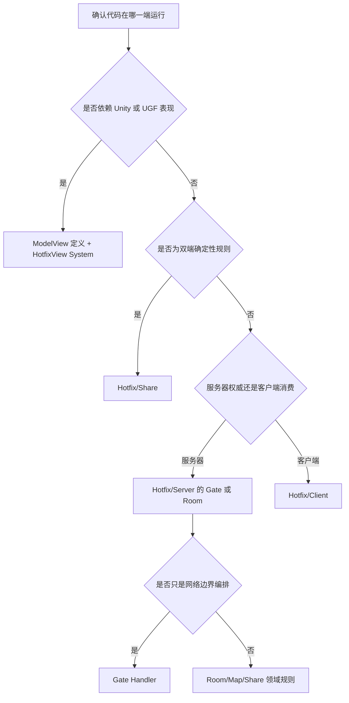

# 模块 33：ET 业务模块开发与重构规范

> Catalog ID: `ET-08`  
> 状态：`verified`  
> 最后核验：`2026-08-07`  
> 适用模式：ET Client / ET Server / Shared / View

## 模块定位

本文把 `ET-SurvivorsDemo` 分支的《ET 业务模块开发与重构经验》整理为当前分支可执行的决策规则，覆盖运行端分层、Entity/Component 所有权、协议边界、对象池、引用缓存、ETReactive 和重构顺序。

外部原文来自提交 `8aa6b7314bcfed4b0b8d976d0a7ae74f29e2252d`，可从 [GitHub 原文](https://github.com/XuToWei/GameDevelopmentKit/blob/ET-SurvivorsDemo/Book/ET%E4%B8%9A%E5%8A%A1%E6%A8%A1%E5%9D%97%E5%BC%80%E5%8F%91%E4%B8%8E%E9%87%8D%E6%9E%84%E7%BB%8F%E9%AA%8C.md) 查阅。原文中的 `SurvivorOnline`、`SurvivorClient`、`SurvivorServer`、`SurvivorView` 和相关 UI 只是另一分支的案例，不代表当前 `codex/UnityCode` 已存在这些业务类。

本文以当前分支源码为最终事实。特别注意：当前分支的 ETReactive 使用“System 静态 Source/Bind + 生成 Observer”的实现，不能照搬原文中的“Entity 实例成员 Source”示例。

## 源码边界

| 类型 | 仓库相对路径 | 说明 |
| --- | --- | --- |
| 运行容器 | `Unity/Assets/Scripts/Library/ET/Core/Runtime/Entity/SceneType.cs` | 当前 SceneType 与 Fiber 运行端边界 |
| 程序集边界 | `Unity/Assets/Scripts/Game/ET/Code/Model/Game.ET.Code.Model.asmdef`、`Hotfix/Game.ET.Code.Hotfix.asmdef`、`ModelView/Game.ET.Code.ModelView.asmdef`、`HotfixView/Game.ET.Code.HotfixView.asmdef` | 数据契约、热更逻辑、Unity 视图契约和视图逻辑 |
| 登录关系 | `Unity/Assets/Scripts/Game/ET/Code/Model/Server/Demo/Gate/SessionPlayerComponent.cs` | Session 到 Player 的 Gate 侧关系，使用 `EntityRef<Player>` |
| 登录生命周期 | `Unity/Assets/Scripts/Game/ET/Code/Hotfix/Server/Demo/Gate/SessionPlayerComponentSystem.cs` | Session 销毁时向 Unit 位置发送断线消息 |
| Session Handler | `Unity/Assets/Scripts/Game/ET/Code/Model/Share/Module/Message/MessageSessionHandler.cs` | 外部消息处理和 RPC Response 生命周期 |
| Session 调用 | `Unity/Assets/Scripts/Game/ET/Code/Model/Share/Module/Message/Session.cs` | RPC 回调、取消、超时和序列化发送 |
| 客户端调用 | `Unity/Assets/Scripts/Game/ET/Code/Hotfix/Client/Demo/Main/ClientSenderComponentSystem.cs` | Main Fiber 到 NetClient Fiber 的 Send/Call 包装 |
| Reactive 契约 | `Unity/Assets/Scripts/Game/ET/Code/Model/Share/Module/Reactive/ETReactiveAttributes.cs` | 当前特性目标和宿主/System 约束 |
| Reactive 生成器 | `Share/SourceGenerator/Generator/ETReactiveSystemGenerator/ETReactiveSystemGenerator.cs` | Source/Bind 校验、排序和 Observer 代码生成 |
| Reactive 诊断 | `Share/SourceGenerator/Config/DiagnosticRules.cs` | ET110x/ET111x 诊断及严重级别 |

## 依赖关系

```text
客户端业务 / UI
  -> ClientSenderComponent
  -> NetClient Fiber
  -> Realm 获取 Gate 地址与 Key
  -> Gate Session 校验并绑定 Player
  -> Gate Handler 做边界编排
  -> Room / Map / Share 执行权威规则
  -> Response / Message 回到网络边界
  -> 领域结果与状态驱动 View
```

- `Model` 定义 Entity、Component、消息和稳定契约；`Hotfix` 实现不依赖 Unity 表现的业务 System。
- `ModelView` 定义依赖 Unity/UGF 的视图 Entity/Component；`HotfixView` 实现 UI、UGF Entity、相机和其他表现 System。
- Shared 规则必须同时满足客户端与服务端依赖边界；服务器权威逻辑不能放入 Gate 或 View。
- SceneType 表示 Fiber 的运行容器和调度边界，不表示 Lobby、Running、Ended 之类业务阶段，也不表示某个 UI 页面。
- 当前分支没有 Survivor 的四类 SceneType。新模块只有在确实需要独立 Fiber/调度边界时才扩展 SceneType，不能机械复制案例命名。

## 入口与调用链

### 新业务模块分层决策



判断目录时依次问“运行端是什么、是否依赖 Unity、是否权威、是否可双端复用”，不要按页面名、协议名或业务阶段建目录。

### 一次 RPC 的所有权链

1. 调用者创建 Request，并让其生命周期覆盖完整 `await`。
2. `ClientSenderComponent.Call` 把 Request 包进内部 Fiber 请求；当前实现只释放内部 `A2NetClient_Response`，把外部 Response 返回给调用者。
3. `Session.Call` 分配 `RpcId`、注册 `RpcInfo`、发送 Request，并在响应、取消或超时时完成等待。
4. `MessageSessionHandler<Request, Response>` 从对象池获取 Response，执行 Handler 后发送并在作用域末释放 Response。
5. 当前 Handler 基类没有统一释放收到的 Request/Message；新增池化消息必须逐条确认最终释放者，不能假定接收端自动回收。
6. Handler 应尽早把协议数据映射为普通值或模块领域结构；业务层和 UI 不长期持有 Request、Response 或 Message。

### ETReactive 表现链

```text
Entity/Component 实现 IETReactiveHost
  -> [ETReactiveSystem] 标记 EntitySystem 静态类
  -> [ETReactiveSource] 静态方法读取 owner 状态
  -> SourceGenerator 生成 Observer 与 ObserveChanges/Reset/Clear 扩展
  -> 生命周期 Update 显式调用 ObserveChanges
  -> 值变化后执行 [ETReactiveBind] 静态方法
  -> OnClose/Destroy 调 ClearReactive
```

当前分支的 AttributeUsage 和生成器要求 Source/Bind 都声明在 System 静态方法上。外部分支中把 Source 写成 Entity public 字段、属性或实例方法的示例不适用于当前代码。

## 核心类型与 API

| 类型/API | 职责 | 生命周期/线程约束 |
| --- | --- | --- |
| `SceneType` | 标识 Fiber 运行容器 | 只为真实调度边界扩展，不承载 UI/阶段状态 |
| `SessionPlayerComponent` | Gate Session 到 Player 的关系 | Player 使用 `EntityRef`；Session 销毁时关系随宿主结束 |
| `MessageSessionHandler<T>` | 单向 Session 消息入口 | 当前不统一释放收到的 Message |
| `MessageSessionHandler<TRequest,TResponse>` | Session RPC 入口与 Response 发送 | Response 由基类 `using`；当前不统一释放 Request |
| `Session.Call` | RpcId、等待、取消和超时 | Request 在等待期间必须存活；Response 所有权交给最终使用者 |
| `Session.Send` | 序列化并提交消息 | 提交后不能立刻回收仍可能被发送链读取的消息 |
| `ClientSenderComponent.Call` | 跨到 NetClient Fiber 发起外网 RPC | 内部包装响应在方法内释放，返回的业务 Response 不会自动释放 |
| `EntityRef<T>` | 跨生命周期引用动态 Entity | 目标可销毁或替换时使用，不缓存裸 Entity 引用 |
| `ETReactiveSystemAttribute` | 标记当前 Reactive System | owner 必须继承 Entity 并实现 `IETReactiveHost` |
| `ETReactiveSourceAttribute` | 标记静态 Source 方法 | 非泛型、返回受支持类型、只接收 owner 参数 |
| `ETReactiveBindAttribute` | 绑定 Source ID 到静态刷新方法 | `static void`，owner 后参数必须匹配 Source |
| `ObserveChanges` / `ClearReactive` | 轮询差分与生命周期清理 | 调用时才观察；不能误当立即事件或权威规则驱动器 |

## 数据与生命周期

### Component 与 Entity 的创建门槛

创建新 Component/Entity 前至少满足一项：随宿主创建和销毁、持有跨调用状态、表达父子所有权、被多个 System 共享，或需要独立 ET 生命周期。只有一个调用点、没有状态的顺序逻辑留在 Handler/System；不要创建零字段、空 `Awake` 的函数收纳盒。

异步创建需要参数时，优先让真正的所有权节点持有状态，并通过 `IAwake<T>` 或明确的输入结构初始化。不要维护可变字典作为“异步构造参数侧表”，否则状态实例被同步层替换后，表现层容易继续引用旧对象。

### 登录和玩家关系

Realm 负责 Gate 分配和凭据，Gate 负责长连接、Session、登录校验及 Player 绑定。玩法只扩展登录后的 Player/Session 关系；只有生命周期、身份或行为确实不同，才新建平行玩家模型。房间关系属于 Player 时，应作为 Player 的 Component，而不是挂成 Gate Scene 全局状态。

### 协议和对象池

- 协议对象只在 Handler、Sender 等网络边界局部存在；跨层使用模块自己的不可变结果或领域 DTO。
- 逻辑结果应包含调用者真正需要的 Error、Message 和业务字段，不能为了取提示文本把整个 Response 交给 UI。
- `Create(true)` 只表示对象来自池，不表示框架会自动选择释放时机。
- Call Request 不能在 `await` 结束前释放；Call Response 由最终使用者读完后释放。
- Send 表示所有权转移。同一个池化 Message 不能广播给多个收件人；每个收件人创建独立消息，非池化 payload 才可按只读契约共享。
- 当前 `MessageSessionHandler` 没有在 `finally` 统一释放收到的 Request/Message。若未来修复，必须一起审计 Session、Actor 转发、多 Handler 分发和 Response，防止重复释放。

### 引用缓存

| 引用性质 | 处理方式 |
| --- | --- |
| 与宿主同生共死且高频访问 | `Awake` 获取一次，缓存普通引用 |
| 可能销毁、替换、换房或跨 Fiber 生命周期 | `EntityRef<T>` 或使用时重新获取 |
| 只用一次 | 局部变量 |
| 只是为了避免空引用 | 修复初始化顺序，不增加兜底缓存 |

缓存不改变所有权。稳定父节点不要在每帧通过属性反复 `GetParent/GetComponent`；同步层可能整体替换的 World/State 不要缓存到 View，缓存应停在不会替换的 Entry/Client 层。

必需依赖由唯一初始化点创建，缺失时尽早失败。`?.`、`??`、`TryGetComponent` 后静默跳过只用于真实可选状态，不能掩盖错误的初始化顺序。

### ETReactive 使用边界

- ETReactive 是轮询式差分机制，适合 UI 文本、显隐、按钮状态、UGF Entity 位置和血条。
- 死亡、掉落、升级、碰撞和阶段推进等权威规则必须在确定的 tick 调用链中完成，不能依赖独立 `IUpdate` 观察者的相对顺序。
- 若权威侧确需复用差分能力，必须由权威 tick 显式调用，写清调用位置；Bind 会修改集合时先快照 ID 再遍历。
- Source 由生成器按方法名 ordinal 排序，不能依赖声明顺序或 Source 改名后的隐式先后表达业务语义。
- 每个 owner 只能有一个 Reactive System；未被 Bind 使用的 Source 会产生警告。
- 自定义 struct Source 需要 `==/!=`；普通引用类型不受支持，`ReactiveBinding.IVersion` 走版本比较。
- 生命周期结束使用 `ClearReactive()`；`ResetReactive()` 只重置初始化状态，不等同于完整清理。
- UIForm 只负责自身内容和输入。跨 `await` 开关多个界面的编排放在界面外；继续访问 Entity 前通过 `EntityRef` 复核存活。

## 开发扩展步骤

1. 从 `KnowledgeBase/catalog.json` 定位 ET、网络、服务端、UI 和脚本规范条目，先确认当前运行端与程序集。
2. 写出状态所有者、创建点、销毁点、调用者和网络边界；没有状态/生命周期时不创建 Component。
3. 将 Gate 编排、Room/Map 权威规则、Share 双端规则、Client 消费和 View 表现拆开。
4. 新增消息时先改 Proto 源并生成；Handler 立即映射协议到领域结构，标出每个池化对象的最终释放者。
5. 为稳定依赖和动态 Entity 分别选择普通引用与 `EntityRef`，禁止用空值兜底替代初始化契约。
6. 使用 ETReactive 时按当前生成器签名写 System 静态 Source/Bind，只承载表现刷新，并在生命周期中显式 Observe/Clear。
7. 纯领域规则增加确定性测试；网络模块验证登录、断线、超时、取消、重连和对象池；View 使用真实 Unity 运行与截图验证。
8. 重构按“驱动顺序 -> 协议边界 -> 状态所有权 -> 动态状态与死代码”推进，每一步重新编译并处理 Analyzer 诊断。

## 约束与常见错误

- 不为 Lobby、Running、Ended 或某个 UI 页面创建 SceneType。
- 不把服务器权威规则放在 Gate Handler、UI 或 HotfixView。
- 不为一个函数创建空 Component，也不让 Runtime 字段长期持有协议对象。
- 不用同一个池化 Message 实例向多个目标 Send。
- 不假定 `ClientSenderComponent.Call`、`Session.Call` 或 Handler 会替调用者释放全部 Request/Response。
- 不把外部分支的 ETReactive Entity 成员示例复制到当前分支；以当前 AttributeUsage、生成器诊断和生成结果为准。
- 不让 UI 自己跨异步流程关闭自己后继续访问 `self`。
- 不把 `?.`、`??` 当成必需依赖的通用容错。
- 不依赖 Reactive Source 的声明顺序；当前实际顺序按方法名排序。
- 不把静态搜索当作运行验证；对象池所有权、Fiber 顺序和 Unity 表现都需要真实执行证据。

## 验证方法

静态审计候选：

```powershell
# SceneType、程序集和业务端边界
rg -n "enum SceneType|SceneType\." Unity/Assets/Scripts/Game/ET/Code Unity/Assets/Scripts/Library/ET/Core/Runtime

# 协议对象是否被 Entity/Component 字段长期持有
rg -n "public .*?(Request|Response|Message).*?(get; set;|;)" Unity/Assets/Scripts/Game/ET/Code

# 池化创建和显式释放
rg -n "Create\(true\)|ObjectPool\.Instance\.Fetch|Dispose\(\)" Unity/Assets/Scripts/Game/ET/Code

# 当前 Reactive 入口与生命周期
rg -n "ETReactive(Source|Bind|System)|ObserveChanges\(|ResetReactive\(|ClearReactive\(" Unity/Assets/Scripts/Game/ET/Code Share/SourceGenerator

# 动态 Entity 裸引用和必需依赖兜底候选
rg -n "EntityRef<|GetParent<|GetComponent<|\?\.|\?\?" Unity/Assets/Scripts/Game/ET/Code
```

文档门禁：

```powershell
powershell -ExecutionPolicy Bypass -File KnowledgeBase/Test-KnowledgeBase.ps1
powershell -ExecutionPolicy Bypass -File KnowledgeBase/Test-KnowledgeBase.ps1 -RequireStaticComplete
```

静态搜索只产生审计候选。业务修改还必须通过 Unity Agent Bridge 触发真实编译，并按影响范围执行 EditMode、登录/断线、网络超时/取消、房间重连和 View 生命周期验证。本轮只核验现有源码与生成器规则，没有新增运行时代码，也没有把外部分支 Survivor Demo 作为当前分支运行通过。

## 源码证据

- `Unity/Assets/Scripts/Library/ET/Core/Runtime/Entity/SceneType.cs`：当前 Fiber 运行容器枚举；没有 Survivor 专用 SceneType。
- `Unity/Assets/Scripts/Game/ET/Code/Model/Server/Demo/Gate/SessionPlayerComponent.cs`：Session 持有 `EntityRef<Player>`，证明动态 Entity 引用规则。
- `Unity/Assets/Scripts/Game/ET/Code/Hotfix/Server/Demo/Gate/SessionPlayerComponentSystem.cs`：Session 销毁和断线消息的当前生命周期行为。
- `Unity/Assets/Scripts/Game/ET/Code/Model/Share/Module/Message/MessageSessionHandler.cs`：RPC Response 由基类 `using`，收到的 Request/Message 当前没有统一释放。
- `Unity/Assets/Scripts/Game/ET/Code/Model/Share/Module/Message/Session.cs`：Request 在发送后进入 RpcInfo 等待；取消和超时移除回调。
- `Unity/Assets/Scripts/Game/ET/Code/Hotfix/Client/Demo/Main/ClientSenderComponentSystem.cs`：内部 Fiber Response 在方法内释放，外部 Response 返回调用者。
- `Unity/Assets/Scripts/Game/ET/Code/Model/Share/Module/Reactive/ETReactiveAttributes.cs`：当前 Source/Bind 的 AttributeTargets 都是 Method。
- `Share/SourceGenerator/Generator/ETReactiveSystemGenerator/ETReactiveSystemGenerator.cs`：静态 Source/Bind、方法名排序和 Observe/Reset/Clear 的真实生成逻辑。
- `Share/SourceGenerator/Config/DiagnosticRules.cs`：owner、签名、重复 Source/Bind、类型、结构体相等和未使用 Source 诊断。

## 关联知识

- 上游：`ARCH-02`、`ET-03`、`SERVER-04`
- 下游：`ET-05`、`ET-07`、`SERVER-05`、`CODE-02`
- 协议生成：[KnowledgeBase/18-Proto协议生成.md](18-Proto协议生成.md)
- ET 网络与锁步：[KnowledgeBase/25-ET网络与锁步.md](25-ET网络与锁步.md)
- 服务端运行链：[KnowledgeBase/30-ET服务端运行链路.md](30-ET服务端运行链路.md)
- 脚本规范：[KnowledgeBase/31-脚本编写规范.md](31-脚本编写规范.md)
