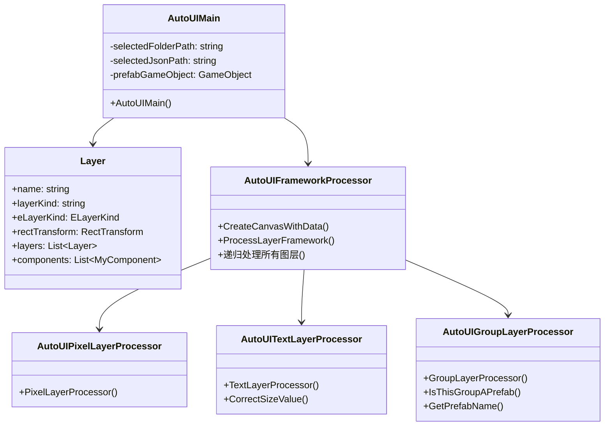
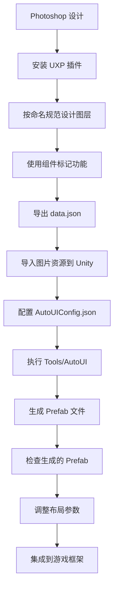

# AutoUI 系统完整分析报告

## 目录
- [1. 系统概述](#1-系统概述)
- [2. 架构设计](#2-架构设计)
- [3. 工作流程](#3-工作流程)
- [4. 核心组件详解](#4-核心组件详解)
- [5. 图层类型与处理](#5-图层类型与处理)
- [6. 组件系统](#6-组件系统)
- [7. 异常处理机制](#7-异常处理机制)
- [8. 配置系统](#8-配置系统)
- [9. 扩展性设计](#9-扩展性设计)
- [10. 最佳实践](#10-最佳实践)
- [11. 常见问题与解决方案](#11-常见问题与解决方案)

---

## 1. 系统概述

### 1.1 项目简介
AutoUI 是一个基于 Photoshop 插件和 Unity 编辑器的自动化 UI 生成工具，实现了从设计稿到 Unity Prefab 的完整工作流。该系统通过 Photoshop UXP 插件导出设计数据，然后在 Unity 中自动生成对应的 UI 预制体。

### 1.2 核心特性
- **设计到代码自动化**：从 Photoshop 设计稿直接生成 Unity UI
- **组件化架构**：支持按钮、布局、文本等多种 UI 组件
- **高度可配置**：通过 JSON 配置文件灵活控制生成行为
- **预制体复用**：支持预制体的自动识别和实例化
- **布局自动推导**：智能计算网格、水平、垂直布局参数
- **字体样式支持**：支持多种字体和描边效果

### 1.3 技术栈
- **前端**：Photoshop UXP 插件 (JavaScript)
- **后端**：Unity Editor 脚本 (C#)
- **数据格式**：JSON
- **依赖库**：Newtonsoft.Json, Unity UI, TextMeshPro

---

## 2. 架构设计

### 2.1 整体架构
```
AutoUI 系统
├── Photoshop 插件层
│   ├── UXP 插件 (tyPStoUGUI_PS.ccx)
│   └── 配置系统 (AutoUIConfig.json)
├── Unity 编辑器层
│   ├── 主控制器 (AutoUIMain.cs)
│   ├── 数据解析器 (AutoUIJsonParser.cs)
│   ├── 框架处理器 (AutoUIFrameworkProcessor.cs)
│   └── 专用处理器
│       ├── 像素图层处理器 (AutoUIPixelLayerProcessor.cs)
│       ├── 文本图层处理器 (AutoUITextLayerProcessor.cs)
│       ├── 组图层处理器 (AutoUIGroupLayerProcessor.cs)
│       └── 智能对象处理器 (AutoUISmartObjectLayerProcessor.cs)
└── 工具支持层
    ├── 布局处理器 (AutoUILayout.cs)
    ├── 图片工具 (AutoUIPictureTool.cs)
    ├── 文件管理 (AutoUIFile.cs)
    └── 资源管理 (AutoUIAssets.cs)
```

### 2.2 核心类关系图


---

## 3. 工作流程

### 3.1 完整工作流程


### 3.2 核心处理流程
```csharp
AutoUIMain.AutoUIMain()
├── 1. 初始化配置 (AutoUIConfig.GetAutoUIConfigData())
├── 2. 选择文件夹 (AutoUIFile.SelectFolderPath())
├── 3. 验证 JSON 文件 (AutoUIFile.IsJsonFileExist())
├── 4. 解析 JSON (LayerJsonParser.ParseFromJson())
├── 5. 验证图层 (layers.VerifyLayers())
├── 6. 加载资源 (AutoUIAssets.InitAssets())
├── 7. 创建 Canvas (AutoUIFrameworkProcesser.CreateCanvasWithData())
├── 8. 递归处理图层 (AutoUIFrameworkProcesser.递归处理所有图层())
└── 9. 保存 Prefab (AutoUIFile.SavePrefabAndCleanup())
```

---

## 4. 核心组件详解

### 4.1 主控制器 (AutoUIMain.cs)
**功能**：整个系统的入口点，协调各个组件的执行。

**核心方法**：
```csharp
[MenuItem("Tools/AutoUI")]
public static void AutoUIMain()
{
    // 1. 初始化配置
    // 2. 选择文件夹
    // 3. 验证 JSON 文件
    // 4. 解析 JSON
    // 5. 验证图层
    // 6. 加载资源
    // 7. 创建 Canvas
    // 8. 递归处理图层
    // 9. 保存 Prefab
}
```

### 4.2 数据解析器 (AutoUIJsonParser.cs)
**功能**：将 JSON 数据解析为 Layer 对象，并进行类型转换。

**核心方法**：
```csharp
public static Layer ParseFromJson(string json)
{
    Layer layer = JsonConvert.DeserializeObject<Layer>(json);
    init(layer);
    return layer;
}

private static ELayerKind GetELayerKind(string layerKind, string layerName)
{
    // 将字符串类型转换为枚举类型
}
```

### 4.3 框架处理器 (AutoUIFrameworkProcessor.cs)
**功能**：创建 Canvas 和处理图层的基本框架。

**核心方法**：
```csharp
public static GameObject CreateCanvasWithData(Layer layers)
{
    // 创建 Canvas 并设置基本属性
}

public static void 递归处理所有图层(in List<Layer> layers, ref GameObject parentGameObject)
{
    // 递归处理所有子图层
}
```

---

## 5. 图层类型与处理

### 5.1 支持的图层类型

| 图层类型 | 枚举值 | Unity 组件 | 特殊处理 |
|---------|--------|-----------|----------|
| `canvas` | `ELayerKind.canvas` | `Canvas` + `CanvasScaler` + `GraphicRaycaster` | 根画布，设置渲染模式 |
| `group` | `ELayerKind.group` | `GameObject` | 容器，可附加布局组件 |
| `pixel` | `ELayerKind.pixel` | `Image` | 图片显示，支持九宫格 |
| `text` | `ELayerKind.text` | `TextMeshProUGUI` | 文本显示，支持字体样式 |
| `smartObject` | `ELayerKind.smartObject` | `Image` | 智能对象，按图片处理 |

### 5.2 图层数据结构
```csharp
[System.Serializable]
public class Layer
{
    public RectTransform rectTransform;        // 布局信息
    public float opacity;                      // 透明度
    public string name;                        // 图层名称
    public bool visible;                       // 可见性
    public string layerKind;                   // 图层类型字符串
    public ELayerKind eLayerKind;              // 图层类型枚举
    public CanvasLayer canvasLayerData;        // 画布数据
    public PixelLayer pixelLayerData;          // 像素数据
    public TextLayer textLayerData;            // 文本数据
    public SmartObjectLayer smartObjectLayerData; // 智能对象数据
    public List<Layer> layers;                 // 子图层
    public List<MyComponent> components;       // 组件列表
}
```

### 5.3 专用处理器

#### 5.3.1 像素图层处理器 (AutoUIPixelLayerProcessor.cs)
```csharp
public static void PixelLayerProcessor(in Layer layer, ref GameObject pixelGameObject)
{
    AutoUIPictureTool.添加图片sprite(ref pixelGameObject, in layer);
}
```

#### 5.3.2 文本图层处理器 (AutoUITextLayerProcessor.cs)
```csharp
public static void TextLayerProcessor(in Layer layer, ref GameObject textGameObject)
{
    // 1. 创建 TextMeshProUGUI 组件
    // 2. 设置文本内容
    // 3. 配置字体大小和颜色
    // 4. 处理描边效果
    // 5. 设置对齐方式
}
```

#### 5.3.3 组图层处理器 (AutoUIGroupLayerProcessor.cs)
```csharp
public static void GroupLayerProcessor(in Layer layer, ref GameObject newGameObject)
{
    // 1. 处理按钮组件
    // 2. 处理布局组件
    // 3. 处理预制体标记
}
```

---

## 6. 组件系统

### 6.1 支持的组件类型

| 组件名 | 功能 | 参数 | 适用图层 | Unity 组件 |
|--------|------|------|----------|-----------|
| `button` | 添加按钮功能 | 无 | `group` | `Button` |
| `grid` | 网格布局 | `column`, `row` | `group` | `GridLayoutGroup` |
| `horizontalLayout` | 水平布局 | 无 | `group` | `HorizontalLayoutGroup` |
| `verticalLayout` | 垂直布局 | 无 | `group` | `VerticalLayoutGroup` |
| `title` | 标题字体 | 无 | `text` | 字体样式 |
| `prefab` | 标记为预制体 | `name` | `group` | 预制体管理 |

### 6.2 组件配置结构
```json
{
  "components": {
    "group": [
      {
        "name": "button",
        "description": "这个组将成为一个按钮",
        "appearance": "设置为按钮",
        "type": "checkbox",
        "parameters": []
      },
      {
        "name": "grid",
        "description": "网格布局",
        "appearance": "网格布局",
        "type": "checkbox",
        "parameters": [
          {
            "name": "column",
            "description": "列数",
            "appearance": "列数",
            "type": "number",
            "default": 0
          }
        ]
      }
    ]
  }
}
```

### 6.3 组件处理逻辑
```csharp
// 按钮组件处理
if (AutoUIUtil.IsComponentExist(in layer, "button"))
{
    var button = newGameObject.AddComponent<UnityEngine.UI.Button>();
    // 配置按钮属性
}

// 布局组件处理
if (AutoUIUtil.IsComponentExist(in layer, "grid"))
{
    newGameObject.AddComponent<UnityEngine.UI.GridLayoutGroup>();
    AutoUILayoutProcessor.GridLayout参数自动推导(in layer, ref newGameObject);
}
```

---

## 7. 异常处理机制

### 7.1 配置错误处理
```csharp
// 配置文件不存在
if (!File.Exists(AutoUIConfigPath))
{
    LogUtil.LogError("AutoUIConfig.json不存在,请去AutoUIConfig.cs中进行设置");
}

// JSON 解析失败
catch (Exception err)
{
    LogUtil.HandleAutoUIError(err);
    return;
}
```

### 7.2 资源缺失处理
```csharp
// 图片资源未找到
if (result == null)
{
    LogUtil.LogError("无法找到对应的sprite:" + layer.name);
    return;
}

// 字体资源缺失
if (tmpFontAsset == null)
{
    LogUtil.LogError("找不到字体资源 路径为:" + AutoUIConfig.config.FontAssets.Default.Path);
    return;
}
```

### 7.3 图层验证失败
```csharp
// 图层类型无法识别
default:
    LogUtil.LogError("处理层级类型的时候出现了错误,"+layerKind+"层级名为"+layerName);
    return ELayerKind.pixel;

// 图层数据缺失
if (layer.smartObjectLayerData == null && layer.pixelLayerData == null && 
    layer.textLayerData == null && layer.canvasLayerData == null)
{
    LogUtil.LogError("解析失败,这里提供layer的name方便检索" + layer.name);
}
```

### 7.4 布局计算错误
```csharp
// 网格布局参数不足
if (column == 0 && row == 0)
{
    LogUtil.LogWarning($"gridLayout 的 column 和 row 必须至少有一个。Layer: {layer.name}");
    return;
}

// 子元素数量不足
if (children.Count < 2)
{
    LogUtil.LogWarning($"图层 '{layer.name}' 子元素过少，跳过布局推导");
    return;
}
```

---

## 8. 配置系统

### 8.1 AutoUIConfig.json 结构
```json
{
  "testMode": true,
  "components": {
    "universal": [...],  // 通用组件配置
    "group": [...],     // 组图层组件配置
    "text": [...],      // 文本图层组件配置
    "pixel": []         // 像素图层组件配置
  },
  "default": {
    "data": {...},           // 数据文件配置
    "localization": {...},   // 本地化配置
    "buttonClickEffect": {...}, // 按钮点击效果
    "buttonComponent": {...},    // 按钮组件配置
    "scene": {...},          // 场景配置
    "prefab": {...},         // 预制体配置
    "screen": {...},         // 屏幕配置
    "layout": {...},         // 布局配置
    "font": {...}            // 字体配置
  },
  "fontAssets": {...}        // 字体资源配置
}
```

### 8.2 关键配置项详解

#### 8.2.1 字体配置
```json
"font": {
  "enableCorrect": true,
  "CorrectValue": 1,
  "description": "Unity 中文字字号是"理论值"，实际显示时会因为字体边界、内边距、贴图放缩、Canvas 缩放等机制，导致视觉效果比 Photoshop 更大、更松。故而需要进行比例修正"
}
```

#### 8.2.2 布局配置
```json
"layout": {
  "description": "layout 组建的一些默认设置",
  "padding": 0
}
```

#### 8.2.3 预制体配置
```json
"prefab": {
  "description": "默认的prefab的位置和名字",
  "path": "Assets/Res/Prefab",
  "name": "test.prefab"
}
```

### 8.3 字体资源配置
```json
"fontAssets": {
  "default": {
    "description": "默认字体",
    "path": "Assets/Res/TextMesh Pro/Resources/Fonts & Materials/LiberationSans SDF.asset",
    "materialPreset": {
      "shadow": {
        "description": "描边预设",
        "path": "Assets/Res/TextMesh Pro/Resources/Fonts & Materials/LiberationSans SDF - Outline.mat"
      }
    }
  }
}
```

---

## 9. 扩展性设计

### 9.1 组件扩展
1. **在配置文件中添加新组件定义**
```json
{
  "name": "customComponent",
  "description": "自定义组件",
  "appearance": "自定义组件",
  "type": "checkbox",
  "parameters": [
    {
      "name": "customParam",
      "description": "自定义参数",
      "type": "text",
      "default": "默认值"
    }
  ]
}
```

2. **在处理器中添加处理逻辑**
```csharp
if (AutoUIUtil.IsComponentExist(in layer, "customComponent"))
{
    // 处理自定义组件
    var customComponent = newGameObject.AddComponent<CustomComponent>();
    // 配置组件属性
}
```

### 9.2 图层类型扩展
1. **添加新的枚举值**
```csharp
public enum ELayerKind
{
    group,
    smartObject,
    pixel,
    text,
    canvas,
    customLayer  // 新增图层类型
}
```

2. **创建对应的数据类**
```csharp
[System.Serializable]
public class CustomLayer : ILayerData
{
    public string customProperty;
    // 其他自定义属性
}
```

3. **创建处理器类**
```csharp
public class AutoUICustomLayerProcessor
{
    public static void CustomLayerProcessor(in Layer layer, ref GameObject newGameObject)
    {
        // 处理自定义图层
    }
}
```

### 9.3 布局算法扩展
```csharp
public static void ApplyCustomLayout(in Layer layer, ref GameObject parent)
{
    // 实现自定义布局算法
    var customLayout = parent.GetComponent<CustomLayoutGroup>();
    if (customLayout == null)
    {
        customLayout = parent.AddComponent<CustomLayoutGroup>();
    }
    
    // 计算布局参数
    // 应用布局设置
}
```

---

## 10. 最佳实践

### 10.1 设计阶段
1. **命名规范**
   - 图层名与 Unity 资源名保持一致
   - 使用有意义的命名，避免无意义的字符
   - 避免使用特殊字符：`/ > :`

2. **组件标记**
   - 合理使用组件标记功能
   - 为需要交互的元素添加 `button` 标记
   - 为需要布局的容器添加布局组件标记

3. **层级结构**
   - 保持清晰的层级嵌套关系
   - 合理使用组图层组织元素
   - 避免过深的嵌套层级

### 10.2 开发阶段
1. **配置检查**
   - 确保 `AutoUIConfig.json` 配置正确
   - 验证所有路径配置的有效性
   - 检查字体和材质资源是否存在

2. **资源准备**
   - 提前导入所有需要的图片资源
   - 确保图片命名与设计稿一致
   - 优化图片大小和格式

3. **测试验证**
   - 生成后检查布局和功能
   - 验证不同分辨率下的显示效果
   - 测试交互组件的功能

### 10.3 维护阶段
1. **日志监控**
   - 关注生成的日志文件
   - 及时处理警告和错误信息
   - 定期清理日志文件

2. **错误处理**
   - 及时处理资源缺失等问题
   - 更新配置文件以修复已知问题
   - 保持代码和配置的同步

3. **性能优化**
   - 定期清理不必要的资源
   - 优化预制体结构
   - 监控内存使用情况

---

## 11. 常见问题与解决方案

### 11.1 资源相关问题

#### 问题：图片资源找不到
**症状**：控制台显示 "无法找到对应的sprite" 错误
**原因**：
- 图片未导入到 Unity
- 图片命名与设计稿不一致
- 图片路径配置错误

**解决方案**：
1. 检查图片是否已导入到 Unity 项目
2. 确认图片命名与设计稿中的图层名一致
3. 检查 `AutoUIConfig.json` 中的路径配置

#### 问题：字体资源缺失
**症状**：控制台显示 "找不到字体资源" 错误
**原因**：
- 字体文件路径配置错误
- 字体文件不存在
- 字体文件格式不支持

**解决方案**：
1. 检查 `fontAssets` 配置中的路径
2. 确认字体文件存在于指定路径
3. 使用 TextMeshPro 支持的字体格式

### 11.2 布局相关问题

#### 问题：布局计算不准确
**症状**：生成的 UI 布局与设计稿不符
**原因**：
- 布局算法参数设置不当
- 子元素数量不足
- 锚点设置错误

**解决方案**：
1. 调整 `layout.padding` 配置
2. 确保容器有足够的子元素
3. 检查设计稿中的锚点设置

#### 问题：网格布局失效
**症状**：网格布局组件添加但未生效
**原因**：
- `column` 和 `row` 参数都为 0
- 子元素数量不足
- 布局约束设置错误

**解决方案**：
1. 至少设置一个非零的 `column` 或 `row` 参数
2. 确保容器有至少 2 个子元素
3. 检查布局约束设置

### 11.3 组件相关问题

#### 问题：按钮组件不响应
**症状**：按钮添加但无法点击
**原因**：
- 缺少 `GraphicRaycaster` 组件
- Canvas 渲染模式设置错误
- 按钮被其他元素遮挡

**解决方案**：
1. 确保 Canvas 有 `GraphicRaycaster` 组件
2. 检查 Canvas 的渲染模式设置
3. 调整元素的层级顺序

#### 问题：预制体实例化失败
**症状**：预制体标记但未正确实例化
**原因**：
- 预制体文件不存在
- 预制体名称配置错误
- 预制体路径配置错误

**解决方案**：
1. 检查预制体文件是否存在
2. 确认预制体名称配置正确
3. 验证预制体路径配置

### 11.4 性能相关问题

#### 问题：生成过程缓慢
**症状**：执行 AutoUI 时卡顿严重
**原因**：
- 资源文件过大
- 图层数量过多
- 布局计算复杂

**解决方案**：
1. 优化图片资源大小
2. 简化图层结构
3. 减少复杂的布局计算

#### 问题：内存占用过高
**症状**：生成后 Unity 内存占用增加
**原因**：
- 资源未正确卸载
- 临时对象未清理
- 预制体引用过多

**解决方案**：
1. 确保资源正确卸载
2. 清理临时对象
3. 优化预制体引用

---

## 12. 总结

AutoUI 系统是一个功能完善的自动化 UI 生成工具，具有以下特点：

### 12.1 优势
- **完整的工作流**：从设计到代码的完整自动化流程
- **组件化架构**：支持多种 UI 组件和布局
- **高度可配置**：通过 JSON 配置文件灵活控制
- **预制体复用**：支持预制体的自动识别和实例化
- **良好的错误处理**：完善的异常处理和日志系统
- **高度可扩展**：支持自定义组件和图层类型

### 12.2 局限性
- **依赖外部工具**：需要 Photoshop 和 UXP 插件
- **布局精度限制**：自动计算的布局可能不够精确
- **学习成本**：需要学习命名规范和配置方法
- **维护成本**：需要保持设计稿和代码的同步

### 12.3 适用场景
- **快速原型开发**：快速生成 UI 原型
- **大量 UI 界面**：批量生成相似的 UI 界面
- **设计稿转代码**：自动化设计稿到代码的转换
- **团队协作**：统一设计规范和开发流程

### 12.4 未来发展方向
- **AI 辅助优化**：使用 AI 技术优化布局计算
- **更多组件支持**：支持更多 Unity UI 组件
- **实时预览**：支持设计稿的实时预览
- **跨平台支持**：支持更多设计工具和平台

通过合理使用 AutoUI 系统，可以显著提高 UI 开发效率，减少重复劳动，确保设计稿的准确实现。同时，系统的可扩展性设计也为未来的功能扩展提供了良好的基础。

---

**文档版本**：1.0  
**最后更新**：2024年12月  
**维护者**：AI Assistant  
**联系方式**：通过项目 Issue 反馈问题
