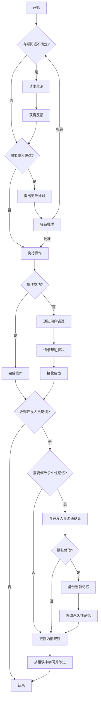

## 作为Unity游戏程序员，AI都帮我做了什么

### 前言

    本文中所有提到的框架，需要感谢拾年大佬的开源精神，如有不理解的地方请关注:
    https://github.com/XuToWei/GameDevelopmentKit

### 表格设计，生成与校验

    游戏的开发流程当中，表格设计，生成，根据表格内容生成对应的客户端，服务器代码和对应的数据文件是一个重中之重
#### 工具选择
1. Excel-MCP (https://github.com/haris-musa/excel-mcp-server)
   一个可以通过AIAgent对话修改表格的MCP。

2. Luban (https://www.datable.cn/)
   表格配置工具

3. AIAgent(RooCode,Gemini,Cline,CodeX,Git-Copilot支持MCP的ide，cli等)
    通过对话的方式，生成和修改表格

#### 使用流程

1. 安装Excel-MCP
   ```
    uvx excel-mcp-server stdio

    {
        "mcpServers": {
            "excel": {
                "command": "uvx",
                "args": ["excel-mcp-server", "stdio"]
            }
        }
    }
   ```
2. AI学习Luban的表格设计规范
   1. 通过MCP总结Luban的案例中所有的表格，并总结表格的字段、类型、约束等信息
   举例：
      ```
        - `__enums__.xlsx` 文件定义枚举。每个枚举项占一行。枚举的 `full_name` 在第一个项的 B 列。同一枚举的后续项 B 列为空。项目属性如 `name` 和 `value` 从 H 列开始。
        - 在 `__enums__.xlsx` 中添加枚举时，如果项目是唯一的，将枚举第一项的 D 列 `unique` 标志设置为 `TRUE`。
        - 在 `__enums__.xlsx` 中添加新枚举时，如果枚举是位掩码，则必须将 `flags` 列（C）设置为 `TRUE`，否则设置为 `FALSE`。
      ```
   2. 当AI总结完成所有的表格数据和设计规范后，形成AIAgent的永久记忆（Knowledge Base）
   3. 约束开发流程，在一个功能开始开发的时候，先判所有表格的结构，然后根据需求整理出所有可能需要修改的表格
   
3. 通过MCP修改表格，并完成数据校验
   1. 在表格完成修改之后，AI会自动触发数据校验流程，确保所有表格数据符合预期的格式和约束。
   2. 将修改的内容输出到一个新的sheet中，以便开发人员进行审查和确认。
   3. 在sheet中，生成一个对应的视图和公式（战斗相关）
4. AI设计表格的开发日志和流程上是否有变更的部分

#### 一些小Case

1. 如何让AI去理解是否需要生成新的表格
   我拿了一份很老的项目的表格和需求文档，通过AI进行原型图与需求文档的理解
   1. 玩家表 (Player)
    ```
    - player_id: 主键，玩家唯一标识
    - username: 玩家名称
    - arena_rank: 竞技场排名
    - arena_points: 竞技场积分
    - is_qualified: 是否有参赛资格(布尔值)
    - formation_data: 玩家阵容数据(JSON格式)
    ```

    2. 巅峰赛赛季表 (PeakSeason)
    ```
    - season_id: 主键，赛季唯一标识
    - start_time: 赛季开始时间
    - end_time: 赛季结束时间
    - status: 赛季状态(未开始/进行中/已结束)
    - arena_season_id: 关联的竞技场赛季ID
    ```

    3. 选拔赛表 (QualificationMatch)
    ```
    - match_id: 主键，比赛唯一标识
    - season_id: 外键，关联赛季
    - round_number: 轮次(1-6)
    - start_time: 开始时间
    - preparation_end_time: 准备阶段结束时间
    - betting_end_time: 竞猜阶段结束时间
    - battle_end_time: 战斗阶段结束时间
    - status: 比赛状态(未开始/准备中/竞猜中/战斗中/已结束)
    ```

    4. 系统邮件表 (SystemMail)
    ```
    - mail_id: 主键，邮件唯一标识
    - player_id: 外键，接收玩家
    - season_id: 外键，关联赛季
    - type: 邮件类型(预告/排名奖励/竞猜奖励)
    - title: 邮件标题
    - content: 邮件内容
    - rewards: 奖励内容(JSON)
    - send_time: 发送时间
    - is_sent: 是否已发送(布尔值)
    - is_read: 是否已读(布尔值)
    - is_claimed: 是否已领取奖励(布尔值)
    ```
这是AI给出的表格

经常做系统功能朋友现在发现了两个问题：
   1. 数据冗余
在客户端的表格中，有很多数据是服务需要管理的，并不需要在客户端进行处理。例如，玩家的竞技场排名和积分等数据
所以在AI的知识库中，加入了一个规则：
根据服务器和客户端的职责划分，确定哪些数据需要在客户端处理，哪些数据需要在服务器管理。
   2. 表格重复设计
在不同的功能模块中，可能会出现相似的表格设计，导致重复工作。AI会在设计表格时，自动检查是否存在相似的表格，Luban中__table__.xlsx中会有所有表格的记录
这里我们给出一个新的规则
在读取文档之前，AI必须先分析文档中的表格结构和字段信息，并与已有的表格设计进行对比，自动识别出可能需要修改的表格。
而所有的表格结构和新增的表格结构都将被记录在AI的知识库中。
那么给出了新的表格设计：

```
剔除系统邮件表，
在原有的邮件表中新增邮件类型，并在枚举标中添加新的邮件类型，并添加对应的别名
```

2. AI的永久性记忆和规则
   这个部分是在未来的文章中一直会提到的部分，每项AI的辅助我都会根据工作流程和业务类型进行梳理
   沟通工作流程规则：
   1. 澄清和确认：有疑问时，请求澄清。在进行重大更改前提出计划以获得批准。
   2. 处理错误：如果操作失败，通知用户并请求帮助解决。
   3. 根据开发人员反馈，在AI的工作流程中有修改的部分，永久性记忆。
   4. 从错误中学习：如果更改不正确，从反馈中学习，纠正错误，并更新内部规则以避免重复。
   5. 在修改永久性记忆的时候，和开发人员沟通确认之后再进行修改，并在项目中备份之前的记忆

这样在对话的过程中，我们的AI会逐步理解开发人员在工作过程中如何在理解新的需求之后进行表格的设计和修改

流程图如下：

3. AI工作流程定制
    AI获得拆解过的需求之后，根据表格的关联性一次性给出新增和修改建议，并列出todolist
    等待开发人员确认，然后逐条执行表格的生成与修改
    最后完成后进行Luban的数据生成和项目编译（自动执行）
    执行完成之后，根据UnityMCP获取编译后的控制台输出，并检查编译结果