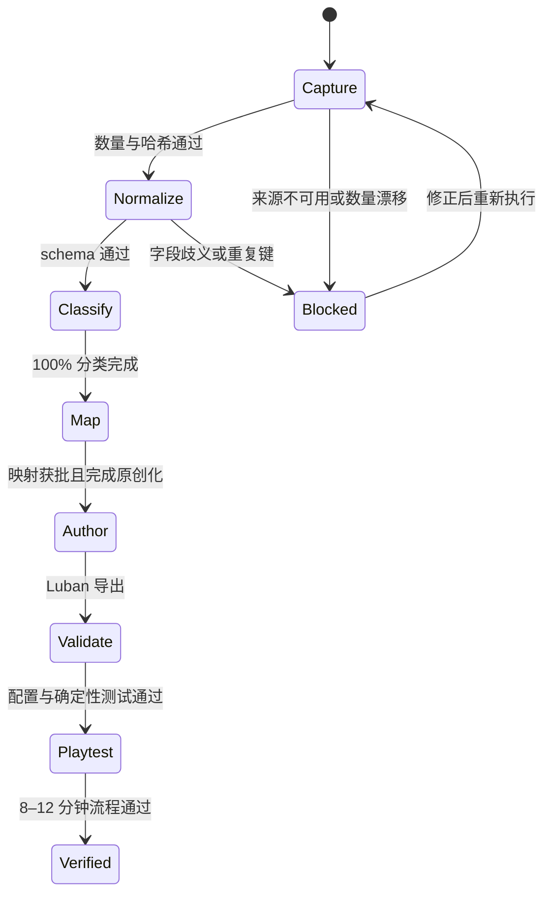

# 《不器》Bazaar v6.0.0 研究原型设计规格

**日期：** 2026-08-07

**状态：** 已收束，待最终审阅

**适用项目：** GameDevelopmentKit / 《不器》

**目标版本：** The Bazaar 当前公开版本 v6.0.0（How Bazaar 页面标注 `v6.0.0 - Feb 04`）

## 1. 决策摘要

本项目不另起一个仿制游戏，而是在现有《不器》异步 PvP 自动构筑原型上建立一套可追溯的 Bazaar 研究资料层，用它校验系统覆盖面、构筑密度、卡牌表达和遭遇节奏。

方案采用双层结构：

1. **完整研究层**：离线归档当前 v6.0.0 的全部公开物品、技能、怪物遭遇和商人资料，保留来源、版本、抓取时间和内容哈希。
2. **原创运行时层**：只把经过能力分类和人工映射的设计结论写入《不器》Luban 配置；运行时不读取外部网站，不直接使用 The Bazaar 的名称、文案、美术、英雄或精确数值。

研究重点选择 **Dooley + Common**。这组公开资料与《不器》已经实现的冷却、充能、加速、护盾、伤害和科技型联动最接近，能以最小的模拟器改动获得最大的系统验证价值。

## 2. 产品目标

### 2.1 玩家承诺

玩家在一局 8–12 分钟的流程中，通过购买、替换、升级、精炼和摆放原创装备形成构筑；战斗自动执行，玩家根据战报理解触发链和失败原因，再调整下一轮方案。对手来自离线快照，因此构筑决策具有 PvP 压力，但不要求双方同时在线。

### 2.2 本阶段成功定义

本阶段完成后应同时满足：

- 公开 v6.0.0 数据有完整、可复查、可重复生成的研究快照。
- 每条外部机制都被分类为可原生表达、可组合表达、仅供参考或本阶段拒绝。
- 精选参考样本能映射到《不器》现有系统，不引入运行时网页解析或不受控脚本文案。
- 可玩原型继续使用《不器》的原创内容：24 件装备、6 个精炼、16 个回响快照和 8 个构筑方向。
- 现有确定性战斗、回放、配置校验和 UI 状态边界保持成立。

## 3. 范围与边界

### 3.1 纳入范围

- 当前公开版本 v6.0.0，不维护历史版本合集。
- 全量研究归档：物品、技能、怪物遭遇、商人。
- Dooley + Common 的重点机制分析。
- 30 件物品、12 个技能、8 场怪物遭遇、6 类商人的精选参考切片。
- 全量能力矩阵、来源追踪、映射清单和验证报告。
- 现有《不器》配置、模拟器、战报和 UI 所需的最小适配。

### 3.2 明确不做

- 不制作 The Bazaar 的可发布复刻版。
- 不把外部名称、卡面、美术、英雄设定或原文描述放入正式运行时资源。
- 不在 Unity 客户端或服务器中调用外部站点。
- 不自动把全部 926 件物品转换为可玩配置。
- 不在本阶段完整实现暴击、弹药、多重施放、变形、摧毁、飞行、维修、价值/收入经济和英雄专属技能。
- 不实现实时 PvP、官方账号、匹配或联网卡池同步。
- 不承诺外部站点未公开的隐藏规则与内部数值。

## 4. 公开资料基线

### 4.1 来源

| 来源 | 用途 | 约束 |
|---|---|---|
| [The Bazaar 官方站](https://playthebazaar.com/) | 产品定位、官方公开信息 | 不作为结构化卡牌数据接口 |
| [How Bazaar Items](https://www.howbazaar.gg/items) | 物品和筛选维度 | 社区数据库，必须记录版本和哈希 |
| [How Bazaar Skills](https://www.howbazaar.gg/skills) | 技能和筛选维度 | 社区数据库，必须记录版本和哈希 |
| [How Bazaar Monsters](https://www.howbazaar.gg/monsters) | 怪物遭遇、携带物品和技能 | 只记录页面公开事实 |
| [How Bazaar Merchants](https://www.howbazaar.gg/merchants) | 商人和服务类型 | 只用于设计研究 |
| [How Bazaar Patch Notes](https://www.howbazaar.gg/patchnotes) | 当前版本确认和版本差异说明 | 本阶段只冻结 v6.0.0 |
| [大巴扎中文站](https://cn.bigbazaar.top/) | 中文术语对照和人工复核 | 站点不可用时不阻塞研究快照 |

### 4.2 观察到的当前规模

在 v6.0.0 页面状态下，How Bazaar 动态列表显示：

| 实体 | 数量 |
|---|---:|
| 物品 | 926 |
| 技能 | 386 |
| 怪物遭遇 | 110 |
| 商人 | 39 |

物品筛选中 Dooley 为 136 件，Common 为 140 件；技能筛选中 Dooley 为 130 个，Common 为 99 个。抓取器必须以实体稳定键去重，不能假定分类集合永远互斥。

这些数字是本次设计冻结时的验收基线。后续抓取若出现数量漂移，流程必须中止并生成差异报告，不得静默覆盖 v6.0.0 快照。

## 5. 原型规则基线

研究层不重写《不器》的核心规则。可玩原型继续遵循当前规则合同：

- 一局由商店决策、装备部署、自动战斗、奖励/战报和下一轮调整构成。
- 棋盘有 8 格；小、中、大型装备分别占 1、2、3 格。
- 双方基础生命为 100，护盾上限为 60。
- 装备按冷却自动使用，效果进入确定性的事件队列。
- 当前原生效果包括伤害、增幅、治疗、再生、中毒、燃烧、冻结、加速、延迟、充能和噪声。
- 相同初始状态、配置版本、随机种子和操作序列必须产生相同战斗结果与回放哈希。
- 对手由回响快照提供；玩家不直接操作战斗单位。
- UI 只投递命令和展示投影，不直接修改局内领域状态。

其中“噪声”是《不器》的原创辨识机制，保留为构筑干扰和风险管理轴，不需要从 Bazaar 中寻找一一对应物。

## 6. 双层数据架构

```mermaid
flowchart LR
    A["公开网页"] --> B["离线原始快照"]
    B --> C["规范化研究目录"]
    C --> D["能力矩阵"]
    D --> E["精选参考映射"]
    E --> F["人工审核的原创 Luban 行"]
    F --> G["TablesComponent.PostResolveRef"]
    G --> H["BuqiGeneratedConfigAdapter"]
    H --> I["BuqiConfigValidator"]
    I --> J["BuqiDefinitionProvider"]
    J --> K["BuqiBattleSimulator"]
    K --> L["Replay / UI"]
```



### 6.1 研究层目录

研究产物固定放在 Unity `Assets` 目录之外，避免被打包或自动导入：

```text
Design/Research/Bazaar/v6.0.0/
├── manifest.json
├── raw/
│   ├── items/
│   ├── skills/
│   ├── monsters/
│   └── merchants/
├── normalized/
│   ├── items.json
│   ├── skills.json
│   ├── monsters.json
│   └── merchants.json
├── classification/
│   └── capability-matrix.json
├── mapping/
│   └── buqi-reference-map.json
└── reports/
    ├── capture-report.md
    ├── coverage-report.md
    └── provenance-report.md
```

`raw` 只保存来源事实；`normalized` 统一字段；`classification` 记录机制可表达性；`mapping` 只记录研究对象与原创《不器》对象之间的设计关系。生成的运行时配置仍沿用现有 Luban 流程，不从这些 JSON 在运行时动态加载。

### 6.2 清单字段

`manifest.json` 必须包含：

- `schemaVersion`
- `gameVersion`
- `capturedAtUtc`
- `locale`
- `sources[]`：`sourceId`、`url`、`contentHash`、`httpState`、`capturedAtUtc`
- `entityCounts`：`items`、`skills`、`monsters`、`merchants`
- `focusCounts`：Dooley/Common 的物品与技能数量
- `generatorVersion`
- `normalizerVersion`

任一原始文件变化都必须改变对应 `contentHash`；同一版本不得原地覆盖，发生变化时输出差异并等待新的快照编号。

### 6.3 规范化实体

所有实体使用命名空间稳定键，例如 `bazaar:v6.0.0:item:{source-key}`。稳定键只存在于研究层。

#### 物品

- `sourceKey`、`name`、`hero`、`tier`、`size`
- `tags[]`、`hiddenTags[]`
- `cooldown`、`ammo`、`multicast`
- `tooltips[]`：按品质保留公开原文和结构化数值槽
- `enchantments[]`
- `monsterDrop`、`sourceUrl`
- `rawRef`、`contentHash`

#### 技能

- `sourceKey`、`name`、`hero`、`tier`
- `tags[]`、`hiddenTags[]`
- `tooltips[]`：按品质保留公开原文和结构化数值槽
- `sourceUrl`、`rawRef`、`contentHash`

#### 怪物遭遇

- `sourceKey`、`name`、`day`、`eventType`
- `health`、`boardSlots`
- `items[]`、`skills[]`
- `rewards[]`
- `sourceUrl`、`rawRef`、`contentHash`

#### 商人

- `sourceKey`、`name`
- `offerRules[]`、`serviceTypes[]`
- `availabilityRules[]`
- `sourceUrl`、`rawRef`、`contentHash`

研究层可以保存网页公开原文以便核对，但不得把这些原文字段复制到运行时本地化表、Prefab、Addressables 或构建产物中。

## 7. 能力矩阵

每个物品、技能、遭遇和商人都必须拆成原子机制，并为每个机制赋予以下唯一状态：

| 状态 | 定义 | 进入运行时的条件 |
|---|---|---|
| `Supported` | 现有《不器》配置和模拟器可以直接表达 | 可进入映射候选 |
| `CompositeSupported` | 可由多个现有效果、触发器和目标规则稳定组合 | 必须有确定性测试向量 |
| `ReferenceOnly` | 有设计价值，但当前运行时无法忠实表达 | 只保留研究记录 |
| `RejectedForPrototype` | 与当前产品边界冲突，或会显著扩大系统复杂度 | 不进入本阶段实现 |

### 7.1 初始分类

| 机制族 | 初始状态 | 《不器》对应 |
|---|---|---|
| 冷却与自动使用 | `Supported` | 现有物品冷却和事件队列 |
| 伤害、护盾、治疗、再生 | `Supported` | Damage / Buffer / Heal / Regen |
| 中毒、燃烧、冻结 | `Supported` | Poison / Burn / Freeze |
| 加速、减速 | `Supported` | Haste / Delay |
| 充能 | `Supported` | Charge |
| 相邻、方向和装备标签条件 | `CompositeSupported` | 目标规则 + 条件 + 多效果组合；逐条验证 |
| 战斗内永久成长或跨局成长 | `ReferenceOnly` | 研究构筑节奏，不直接导入 |
| 暴击、弹药、多重施放 | `ReferenceOnly` | 当前模拟器无完整合同 |
| 变形、摧毁、飞行、维修 | `ReferenceOnly` | 当前装备生命周期无完整合同 |
| 价值、收入和英雄专属经济 | `RejectedForPrototype` | 与本阶段原创商店合同不一致 |
| 外部英雄被动和专属卡池 | `RejectedForPrototype` | 不复制英雄与卡池身份 |

初始分类只是机制族默认值。单条记录若混合多个机制，其最终可用状态取最严格值；不能因为其中一部分可表达就忽略其余行为。

### 7.2 分类输出

`capability-matrix.json` 的每条记录必须包含：

- `sourceEntityKey`
- `atomicBehaviors[]`
- `classification`
- `buqiPrimitives[]`
- `determinismRisk`
- `runtimeLifecycleRisk`
- `reason`
- `reviewedBy`
- `reviewedAtUtc`

全量实体必须达到 100% 分类覆盖，未分类记录会使研究校验失败。

## 8. 精选参考切片

精选切片不是直接导入列表，而是用于证明《不器》系统能够覆盖足够多的有意义构筑关系。

### 8.1 30 件物品

只从 Dooley + Common 中选取，配额固定如下：

| 机制重点 | 数量 |
|---|---:|
| 冷却、标签、相邻与基础触发链 | 6 |
| 直接伤害 | 4 |
| 护盾与防御转化 | 4 |
| 充能 | 3 |
| 加速与减速 | 3 |
| 冻结与控制 | 3 |
| 治疗与再生 | 2 |
| 燃烧 | 2 |
| 中毒 | 2 |
| 变形或摧毁，仅作负向边界样本 | 1 |
| **合计** | **30** |

选择算法固定为：先按机制配额过滤，再按 `Supported`、`CompositeSupported`、`ReferenceOnly` 的优先级排序；同级按标签匹配数降序、最低可用品质升序、`sourceKey` 升序选择，并保证稳定键不重复。最终名单写入映射清单后冻结，后续只能通过显式评审变更。

### 8.2 12 个技能

六个研究族各取 2 个：伤害成长、防御成长、冷却/加速、充能、状态联动、经济/变形边界。前五族用于寻找 6 个原创精炼的表达密度，第六族只证明系统边界，不进入运行时。

选择顺序与物品一致；相同排名下按 `sourceKey` 升序冻结。

### 8.3 8 场怪物遭遇

以现有 8 个《不器》构筑方向为目标，每个 `BuildId` 选择一场机制相似度最高的公开遭遇。相似度按共享效果族数量、共享节奏标签数量、所需未支持机制数量依次排序，仍相同时按 `sourceKey` 升序。

每场参考遭遇对应两个现有原创回响快照：一个教学强度、一个成型强度，共 16 个回响。这里只记录“节奏与克制关系”，不复制怪物名称、卡组、文本或精确数值。

### 8.4 6 类商人

研究切片覆盖以下服务族：装备销售、专门标签销售、升级、精炼/附魔、回收/出售、刷新。每族选择规则表达最清晰的一个公开商人记录；若该族只有 `ReferenceOnly` 或 `RejectedForPrototype` 记录，仍可进入研究切片，但不得据此扩展运行时合同。

### 8.5 运行时内容不变式

研究切片最终映射到现有原创内容，而不是替代它：

- 24 件《不器》装备保持原创名称、描述、数值和美术。
- 6 个《不器》精炼保持原创机制表达。
- 16 个《不器》回响快照保持原创身份和构筑。
- 8 个构筑方向继续作为覆盖目标。
- 外部研究稳定键不得成为玩家可见 ID。

## 9. 映射清单

`buqi-reference-map.json` 每条映射必须包含：

- `referenceId`
- `sourceEntityKeys[]`
- `buqiEntityType`
- `buqiEntityId`
- `sharedBehaviors[]`
- `intentionallyDifferentBehaviors[]`
- `unsupportedBehaviors[]`
- `originalizationNotes`
- `runtimePromotionStatus`
- `evidenceRefs[]`

`runtimePromotionStatus` 只允许：

- `ResearchOnly`
- `Candidate`
- `ApprovedForAuthoring`
- `Implemented`
- `Verified`

状态只能单向推进。`ApprovedForAuthoring` 之前不得修改 Luban；`Implemented` 之前必须通过版权/IP 泄漏扫描；`Verified` 必须同时通过配置校验、确定性战斗测试和可玩流程测试。

## 10. 运行时集成原则

现有运行时链路保持为唯一真实来源：

```text
Luban 生成数据
  -> TablesComponent.PostResolveRef
  -> BuqiGeneratedConfigAdapter.TryReadFromTables
  -> BuqiConfigValidator
  -> BuqiDefinitionProvider
  -> BuqiBattleSimulator.Simulate
  -> BattleReplay
  -> UI 投影
```

研究工具不得绕过或替换这条链路。具体约束：

- 不在 `Game/Hot/Code` 中加入 HTTP 客户端、HTML 解析器或社区数据库 SDK。
- 不把任意 tooltip 文本解释器带入模拟器。
- 新机制必须先成为类型化配置和明确的领域合同，再进入模拟器。
- Luban 生成代码仍由现有工具产生，不手改生成目录。
- 适配器发现未知枚举、缺失引用或不支持效果时必须失败，不得使用默认值继续运行。
- 现有战斗版本、配置版本和回放哈希规则发生变化时必须显式升级版本。

## 11. 离线研究流程



抓取、规范化、分类和映射都属于编辑器外工具流程。Unity 构建只消费已经审核的原创 Luban 结果，因此外部站点离线不会影响游戏启动、战斗或服务器运行。

## 12. 异常处理

| 异常 | 处理 |
|---|---|
| 来源站点不可达、限流或 Cloudflare 拦截 | 保留最后一次完整快照；记录失败来源；不影响运行时，不用其他来源静默拼接 |
| 页面仍标 v6.0.0 但数量或哈希变化 | 中止覆盖，生成差异报告和新的捕获编号 |
| 同一实体出现重复稳定键 | 规范化失败，输出全部冲突来源 |
| tooltip 无法可靠拆成原子机制 | 标为 `ReferenceOnly` 并保留原文证据，不推测运行时行为 |
| 映射引用不存在 | 映射校验失败，不允许进入 `ApprovedForAuthoring` |
| 映射混入未支持机制 | 配置校验失败，不允许 Luban 结果进入原型 |
| 运行时内容出现外部专名或原文 | IP 泄漏扫描失败，构建门禁阻止发布 |
| 新配置改变旧确定性向量 | 必须解释版本变化；无显式版本升级则视为回归 |
| 中文站与英文数据冲突 | 英文结构化记录作为事实基线，中文只保留术语对照和冲突注记 |

## 13. 测试策略

### 13.1 研究工具测试

- 使用固定 HTML/JSON fixture 验证四类实体解析。
- 验证 926/386/110/39 的基线计数和 Dooley/Common 聚焦计数。
- 验证稳定键去重、哈希重现、来源 URL 和原始引用完整性。
- 对缺字段、重复键、未知品质、未知尺寸和混合 tooltip 建立失败用例。
- 验证同一输入重复执行产生字节稳定的规范化结果。

### 13.2 分类与映射测试

- 全量记录分类覆盖率必须为 100%。
- 30/12/8/6 配额必须精确满足，稳定排序重复执行结果一致。
- `CompositeSupported` 每条至少有一个确定性效果组合测试。
- `ReferenceOnly` 和 `RejectedForPrototype` 不得出现在运行时 Luban 输入中。
- 每个运行时对象必须能追溯到原创化说明，不允许直接文本复制。

### 13.3 运行时回归测试

- `BuqiGeneratedConfigAdapter` 对完整、缺失和未知字段分别验证。
- `BuqiConfigValidator` 拒绝悬空引用、重复 ID 和不支持效果。
- `BuqiDefinitionProvider` 深拷贝与版本读取保持稳定。
- `BuqiBattleSimulator` 的既有确定性向量和回放哈希保持通过。
- 新增原创配置的每个构筑方向至少包含胜、负和超时边界用例。
- 验证重开、继续、回放、切换对手和 8 格拖拽部署流程。
- 在目标 Unity 版本下完成编辑器运行、目标分辨率和构建产物检查。

### 13.4 发布边界测试

- 扫描 Runtime、Resources、Addressables、Prefab、本地化表和构建产物中的外部专名。
- 扫描外部公开原文的长片段匹配。
- 确认 `Design/Research/Bazaar` 未进入 Unity 资源清单或服务器发布包。
- 断网启动和完整一局流程必须成功。

## 14. 验收标准

设计进入实现完成态必须满足以下全部条件：

1. `manifest.json` 记录 v6.0.0、来源、时间、哈希和 926/386/110/39 四类实体计数。
2. 四类规范化目录可由冻结原始快照重复生成，输出字节稳定。
3. 全量实体完成 100% 能力分类，没有空状态或无理由分类。
4. 精选切片严格包含 30 件物品、12 个技能、8 场遭遇和 6 类商人。
5. 映射清单的每个条目都包含共享行为、刻意差异、不支持行为和原创化说明。
6. 运行时仍只使用原创的 24 件装备、6 个精炼、16 个回响快照和 8 个构筑方向。
7. Unity 客户端和服务器没有外部站点网络依赖，也没有运行时 tooltip 解析。
8. 外部名称、原文和美术未进入可发布运行时资产。
9. 现有配置校验、确定性模拟和回放测试全部通过。
10. 一局 8–12 分钟的商店、部署、自动战斗、战报、调整与重开流程可完整运行。

## 15. 实施工作包

后续实现计划按依赖顺序拆为五个工作包：

1. **A：快照与来源层**

   定义 manifest 和 raw 目录，完成四类来源的离线捕获、哈希、计数和 fixture。

2. **B：规范化与能力分类**

   建立类型化 schema、稳定键、全量规范化、原子机制词典和 100% 分类报告。

3. **C：精选切片与映射**

   执行 30/12/8/6 的确定性选择规则，建立原创化映射和 IP 边界检查。

4. **D：原创运行时配置验证**

   只对获批映射调整 Luban 原始表和必要的类型化合同，复用现有 adapter、validator、provider、simulator 和 replay 链路。

5. **E：证据化 QA**

   完成回归、断网、构建、实际游玩、截图/日志、回放哈希和来源报告，并依据第 14 节逐项验收。

工作包 A–C 不修改 Unity 运行时；D 必须在 A–C 的评审结果冻结后开始；E 使用实际构建证据，不以静态代码检查代替可玩验证。

## 16. 最终原则

这套研究的价值不是复制卡牌数量，而是回答三个可验证的问题：什么机制形成有效构筑，现有《不器》能忠实表达多少，哪些差异应该成为自己的设计。外部数据始终是有来源、可冻结、不可直接发布的研究证据；《不器》的规则、内容身份和运行时合同始终由项目自身定义。
